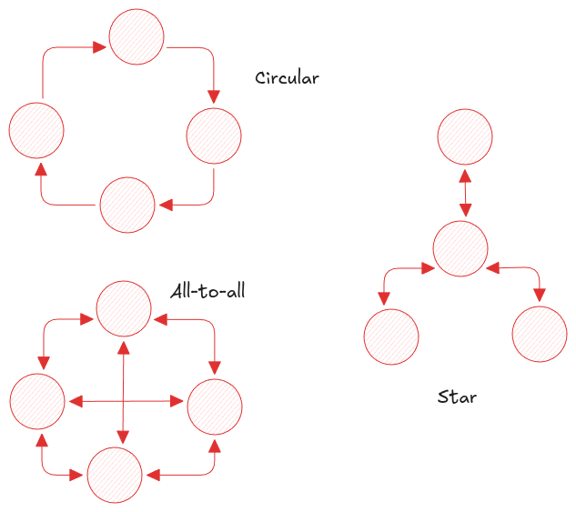

# Replication

Replication helps to maintain multiple copies of the same data across different machines. It is used to ensure high 
availability, scale systems by distributing queries across machines, and reduce latency by storing data closer to users. 
To address this, distributed databases use one of three approaches: single-leader, multi-leader, or leaderless.


## Leader and Follower

Nodes that store copies of data are called _replicas_. To propagate data across replicas, the most common approach is
**leader–follower** replication, where all writes go to a leader, which then propagates changes to follower replicas. 
A key consideration in this model is whether if replication is done _synchronously_ or _asynchronously_.

In synchronous replication, a write completes only after the leader confirms successful replication to all followers. 
This ensures strong consistency but can delay or block writes if followers cannot keep up.

!!! note "Semi-synchronous"
    A fully synchronous system is impractical because a single failed follower can halt the system. To mitigate this,
    many databases use semi-synchronous replication, where only one follower is kept synchronous with the leader while 
    others remain asynchronous. If the synchronous follower fails, another follower can be promoted to avoid system 
    downtime.

Most leader-based replication systems use asynchronous replication. This avoids blocking the leader when followers lag 
or fail, but it weakens durability: if the leader fails before data is replicated, recent writes may be lost.

!!! annotate "Chain Replication"
    Weak durability has led to alternative approaches such as **chain replication**(1), which improve performance and 
    availability without sacrificing durability. Later chapters also explore how consensus mechanisms help achieve 
    stronger consistency.
1. variant of synchronous replication, implemented in Azure storage

---
**Handling Follower Addition**

Directly copying data files to a new node is insufficient because data continues to change due to ongoing writes. 
Locking the database during copying would degrade performance and availability. Instead, systems handle this using 
following sequence of steps that allow data to be copied while writes continue.

```mermaid
--8<-- "docs/Books/ddia/diagram/c5_follower_addition_replication.mmd"
```

---

**Handling Node Outages**

The system must remain available even when some nodes fail, whether due to faults or planned maintenance. When a 
follower fails because of a temporary issue such as a network partition or restart, it can catch up by requesting logs 
generated after its last processed entry. Each follower maintains its own record of processed logs.

Handling leader failure is more complex. One of the existing followers must be promoted to leader, clients must 
redirect writes to the new leader, and remaining followers must begin replicating from it. 
This process is called **failover**. Automatic failover typically involves the following steps:

- Detect leader failure using a heartbeat mechanism; a node that does not respond within a timeout is considered failed.
- Elect a new leader through a consensus-based election among nodes.
- Reconfigure the system so clients send writes to the new leader, followers replicate from it, and a restarted old leader rejoins as a follower.

Automatic failover introduces several challenges:

- With asynchronous replication, unreplicated writes from the old leader may be lost after failover, violating durability.
- Discarding writes is risky, especially when external systems depend on them.
- If both the old and new leader accept writes simultaneously (split brain), conflicting data may be written, leading to corruption.
- Choosing an appropriate timeout is difficult: long timeouts delay recovery, while short timeouts cause unnecessary failovers.

Due to these risks, failover is often performed manually.

---

**Implementation of Replication Logs**

Replication can be implemented using the following approaches:

- **Statement-based**: The leader sends the original write statements (such as `INSERT` or `UPDATE`) to followers, 
  which re-execute them to reproduce changes. This approach breaks down with nondeterministic statements
  (for example, `NOW()`), auto-incremented columns, or other side effects. Although these issues can be mitigated by 
  enforcing determinism, the number of edge cases makes this approach less practical.

- **Copying WAL**: Followers receive the database’s write-ahead (redo) logs and apply them locally. These logs describe
  low-level byte changes and are tightly coupled to the storage format. As a result, all replicas must use the same 
  storage layout. This coupling complicates upgrades, which are typically performed on followers first; incompatible 
  storage formats can force downtime.

- **Row-based**: Instead of reusing storage-engine redo logs, systems maintain a separate logical log designed for 
  replication. In relational databases, this log records row-level changes (for example, MySQL binlogs). Keeping 
  logical logs decoupled from the storage engine allows leaders and followers to run different storage versions or 
  even different engines. These logs can also be consumed by external systems through change data capture, enabling 
  use cases such as custom indexing or data warehousing.

- **Trigger-based**: The previous approaches are implemented within the database and offer limited flexibility, such as
  replicating only a subset of data. Trigger-based replication moves this logic to the application layer using triggers 
  and stored procedures to execute custom code. This provides greater flexibility but introduces higher overhead 
  compared to built-in mechanisms.


## Problems with Replication Lag

Replication is not only used to improve fault tolerance but also enables system scaling and reduces request latency. 
The leader–follower model is well suited for read-heavy workloads, as read requests can be served by follower nodes. 
This approach is not viable with synchronous replication, since a single failed follower can block the entire system, 
and the likelihood of such failures increases as more followers are added.

With asynchronous replication, read scalability is possible, but followers may serve stale data because there is no 
bound on how far they can lag behind the leader. This inconsistency is temporary and resolves once followers catch up,
making the system **eventually consistent**.

Replication lag is usually measured in fractions of a second but can grow significantly when the system operates near
capacity. As lag increases, it can introduce inconsistencies that negatively affect application behavior. Few of such
behaviours are following:

**Reading Your Own Writes**

Data written by a user must be immediately visible to that same user, even if other users see the update later. This
guarantee is called **read-after-write consistency**. Without it, users may observe stale data, interpret it as a bug, 
and repeat the write.

In leader-based replication, read-after-write consistency can be achieved in several ways:

- Route reads from the writing user to the leader. This works well for data that only the user can modify, such as a 
  user profile, but requires identifying whether a read depends on the user’s recent write.
- When many parts of the system are user-editable, selectively routing reads becomes harder. In such cases, systems can
  use metadata such as last-modified timestamps and observed replication lag to decide whether a read should go to the 
  leader or a follower.
- The client can track the timestamp or logical position (for example, a log sequence number) of its last write.
  Reads are then directed to a replica that has applied updates at least up to that point. If no such replica is 
  available, the request can be forwarded to the leader or delayed until a replica catches up.

In multi-device scenarios, additional care is required. To maintain read-after-write consistency across devices, 
write metadata such as last-modified timestamps must be centralized and shared across all client sessions.

---

**Monotonic Reads**

Consider replying to a YouTube comment and accidentally refreshing the page. If the refreshed request is served by a 
lagging replica, the user may see older data than before, making the experience confusing. This anomaly is prevented 
by **monotonic read** consistency, which guarantees that a user’s sequence of reads never moves backward in time.
Once a value has been observed, subsequent reads will not return older data.

```mermaid
--8<-- "docs/Books/ddia/diagram/c5_monotonic_read.mmd"
```

Monotonic reads provide stronger guarantees than eventual consistency but are weaker than strong consistency. A common 
way to implement them is to route all reads from a user to the same replica, for example by hashing on the user ID 
instead of distributing requests randomly.

---

**Consistent Prefix Reads**

Extending the previous example, consider a comment thread where each comment is fetched separately. If the main comment
and its reply are served by different replicas, a lagging replica may return the reply before the original comment, 
violating their causal order.

```mermaid
--8<-- "docs/Books/ddia/diagram/c5_consistent_prefix_read.mmd"
```

**Consistent-prefix reads** prevent this anomaly by guaranteeing that reads observe writes in the order they were 
applied. If a user sees a later update, they will not miss earlier ones. This problem becomes more pronounced in 
partitioned systems, where partitions operate independently and global ordering is difficult to maintain.

To avoid inconsistent prefix reads, related writes should be routed to the same partition so their relative order is
preserved.

---

These consistency techniques must be applied selectively, especially when replication lag can grow to minutes or hours.
In shared-nothing architectures, transactions traditionally provide such guarantees by encapsulating complexity within
the database. In distributed systems, however, providing full transactional guarantees across nodes often limits 
scalability and availability, making weaker consistency models a practical trade-off.

## Multi-Leader Replication

Leader–follower replication introduces a single point of failure: if the leader is unavailable, the database cannot 
accept writes. To address this, the model can be extended to allow multiple nodes to accept writes. This is known as
**multi-leader replication**, where each leader also acts as a follower of the others.

Multi-leader replication improves write availability and reduces latency for clients located far from a single
write node. However, it introduces the risk of write conflicts between leaders, especially across datacenters. 
Features such as auto-increment keys, triggers, and uniqueness constraints become harder to manage, which is why
most databases support multi-leader setups only through extensions. As a result, it should generally be avoided 
unless the use case clearly requires it.

Common use cases include:

- **Multi-datacenter deployments**: With leader–follower replication, all writes must go through a single datacenter. 
  Multi-leader replication allows each datacenter to have its own leader, which then replicates changes to other datacenters.
- **Offline client operations**: Applications that allow writes while offline must later synchronize data with a
  central system. In this model, each client temporarily acts as a leader and replicates its changes once connectivity is restored.
- **Collaborative editing**: Applications such as Google Docs allow multiple users to edit the same document 
  concurrently. Changes are applied locally and asynchronously replicated to other clients. Using locks would reduce 
  this to a single-leader model, so real-time collaboration avoids locking and instead uses fine-grained changes and conflict resolution.

---

**Handling Write Conflicts**

Multi-leader replication can produce conflicting writes when multiple leaders modify the same data. These conflicts are
often detected long after the original writes, which makes resolution more complex.

The simplest way to handle conflicts is to prevent them by routing writes for the same data to a single leader. This 
approach fails when that leader is unavailable, forcing writes to be sent to another leader and reintroducing conflicts.

Another approach is to attach metadata that allows writes to be ordered and converged to a single value. For example,
each write can carry a unique, orderable identifier, and the system can select the write with the highest order as 
the winner. When timestamps are used, this strategy is known as **last-write-wins**. While simple, it can silently 
discard updates and lead to data loss. Similar trade-offs exist when prioritizing certain replicas over others.

Other strategies include merging conflicting values and exposing them to users for manual resolution. Many multi-leader
replication systems also allow custom conflict-resolution logic by registering application code that runs when conflicts are detected.

Conflict resolution typically operates at the record level rather than the transaction level. As a result, even writes
issued atomically within a transaction may be resolved independently when conflicts occur.

### Automatic Conflict Resolution

Conflict resolution rules significantly increase system complexity, and custom resolution code further raises the risk
of errors. This has driven research into data structures that can resolve conflicts automatically.

- **CRDTs (Conflict-Free Replicated Data Types)** provide a set of commonly used data structures that converge automatically under concurrent updates.
- **Mergeable persistent data structures** track version histories and resolve conflicts using three-way merge functions.
- **Operational transformation** enables concurrent editing of ordered data and is used in systems such as Google Docs.


### Multi-Leader Replication Topologies

Replication topology defines the paths through which data is propagated between nodes. With two leaders, only a single
topology is possible, where each leader replicates data directly to the other.
{loading=lazy width=400vw align=right}
With more than two leaders, multiple topologies are possible. In an all-to-all topology, every leader sends its writes 
to every other leader. In star or circular topologies, writes pass through one or more intermediate nodes before 
reaching all replicas. To prevent infinite replication loops, each node tags writes in the replication log to indicate 
which nodes have already processed them.

Unrestricted topologies such as all-to-all can suffer from network congestion, often due to uneven infrastructure
between nodes. Restricted topologies like star or circular reduce network traffic but introduce fragility, as the 
failure of a single node can disrupt replication across the entire topology.

## Leaderless Replication

Inspired by Amazon Dynamo (not DynamoDB), leaderless replication does not assign a fixed write order or a designated 
leader. Writes are sent to multiple nodes, either directly by the client or via a coordinator node. A write is
considered successful only after it is accepted by a predefined number of nodes. For reads, requests are also sent to 
multiple nodes, and the version returned by the majority is treated as the correct result.

Leaderless replication uses two mechanisms to handle replication lag:

- **Read repair**: During reads, stale values can be detected and overwritten with the latest version. This works 
  well for data that is read frequently.
- **Anti-entropy process**: A background process periodically detects differences between replicas and propagates 
  the latest updates. Unlike replication logs, updates are exchanged without preserving write order.

### Quorums

Quorums define the minimum number of nodes that must acknowledge an operation for it to be considered successful. 
They ensure that reads remain consistent as long as both reads and writes involve overlapping sets of nodes. For 
example, if a write is confirmed by 2 out of 3 nodes, a read from 2 out of 3 nodes is guaranteed to include at least 
one node with the latest data.

Formally, with $n$ replicas, a write must be acknowledged by $w$ nodes and a read must consult $r$ nodes. If $w + r > n$
, at least one of the $r$ nodes will have the most recent write. Such configurations are called **quorum reads and writes**.

A common best practice is to use an odd number of replicas and set $w = r = (n + 1) / 2$, ensuring a majority overlap. 
In practice, reads and writes are often sent to all available nodes, but the operation is considered complete as soon
as a quorum responds.

Quorums do not always require a majority. They only require overlap between the nodes used for reads and writes. Using 
smaller values of $w$ and $r$ (where $w + r \le n$) can improve performance but may return stale data. Even
when $w + r > n$, stale reads are still possible in certain edge cases:

- Sloppy quorums may involve different nodes for reads and writes, removing the guarantee of overlap.
- Concurrent writes require conflict resolution and may lead to ambiguous results.
- Reads that occur concurrently with writes can return outdated values.
- If a write fails to reach a quorum, it may still be partially applied and not rolled back.
- If a node that participated in a write fails and later recovers from a non-quorum node, the overlap guarantee can be broken.

Because of these limitations, quorums should not be treated as absolute guarantees. Most databases using leaderless 
replication instead embrace eventual consistency, and the same replication-lag issues discussed earlier can arise if not explicitly addressed.

Monitoring read staleness and identifying lagging nodes is therefore important. This is easier in leader-based systems, 
where ordered writes allow replication lag to be measured directly. In leaderless systems, replication is unordered, 
making staleness harder to detect and reason about.

### Sloppy Quorums and Hinted Handoff

When a quorum cannot be reached, a system must choose between rejecting the write or accepting it anyway.
Accepting the write is known as **sloppy quorum**. In this model, reads and writes still require $w$ and $r$ successful
responses, but the data may be temporarily stored on nodes outside the original $n$ replicas for that key. Once the
original replicas recover, the data is moved back using **hinted handoff**.

Sloppy quorums are primarily used to improve write availability. As long as $w$ nodes are reachable in any partition,
writes can succeed even if the original replica set is unavailable. However, this approach does not guarantee fresh
reads, even when $w + r > n$. As a result, it is not a true quorum and trades consistency for availability.

Leaderless replication is also well suited for multi-datacenter deployments. It tolerates conflicting writes, network 
partitions, and latency spikes. For example, Cassandra uses leaderless replication across datacenters by 
maintaining $n$ replicas per datacenter. Writes are sent to replicas in all datacenters, but quorum is required only
within the local datacenter to avoid delays caused by cross-datacenter communication.

### Detecting Concurrent Writes

Leaderless replication can still produce write conflicts even with strict quorums, and blindly overwriting values can
leave the system in an inconsistent state. Resolving these conflicts requires convergence toward a single value, which
can be achieved using several strategies, each with trade-offs.

**Last Write Wins**

If the system can determine which update is the most recent, it can discard older values and converge on a single 
result. While true recency is undefined for concurrent writes, systems impose a logical order using timestamps or 
sequence numbers and retain the latest entry. This approach is known as **last-write-wins** and is the default in
systems such as Cassandra.

Last-write-wins achieves convergence at the cost of durability. Multiple concurrent writes may be acknowledged to 
clients, yet only one value is preserved, resulting in lost updates. For this reason, LWW is commonly used in cache
systems. Databases that prioritize durability and uses LWW often avoid concurrent updates by writing keys once and treating them as
immutable.


---

**“Happens-Before” Relationship and Concurrency**

An operation $A$ *happens before* another operation $B$ if $B$ has knowledge of $A$. Two operations are considered
concurrent if neither has context about the other. Distinguishing between ordered and concurrent operations allows
the system to decide whether a value can be safely overwritten or whether a conflict must be resolved.

This relationship can be captured using versioning:

- The server maintains a version number for each key and increments it on every write, storing it with the value.
- On reads, the client receives all values that have not been overwritten, along with the latest version number.
- On writes, the client includes the version number from its prior read and submits the merged value.
- When the server receives a write with a given version, it can safely overwrite values with the same or lower 
  versions, but must retain values with higher versions as concurrent.

Including a version number in a write indicates the state on which the update is based. A write without a version number
is treated as concurrent with all others, so it does not overwrite existing values and will appear alongside them in subsequent reads.

This approach prevents silent data loss but shifts conflict resolution to the client, which must merge concurrent 
values. Merging must be done carefully. For example, using a simple union to merge shopping-cart items can reintroduce
items that were removed in a concurrent update. A common mitigation is to use tombstones to represent deletions instead
of removing keys outright.

In systems with multiple replicas, a single version number is insufficient. Instead, each replica maintains its own 
version counter per key. The collection of these counters forms a **version vector**, which allows the system to 
distinguish between causal overwrites and true concurrency.
