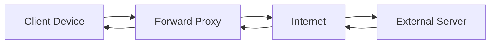
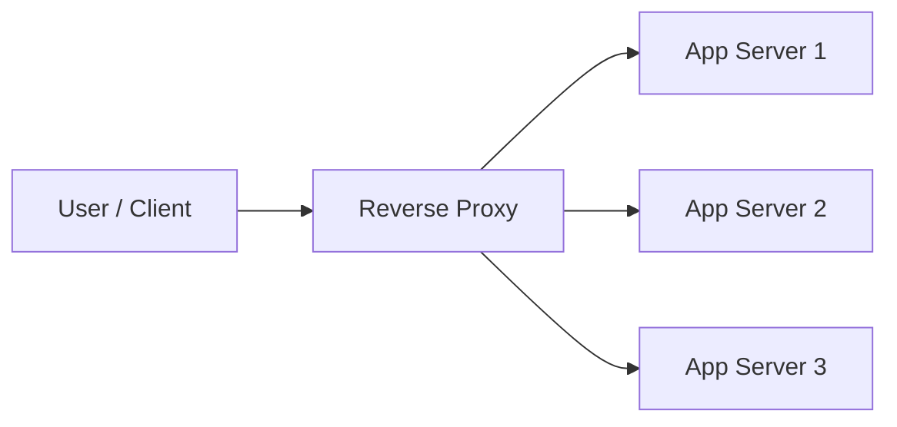

# Miscellaneous

## How large can a TCP packet get?

TCP operate on unit of data called segments, segments are packed in packets, packets are packed into frame. Frames have
a fixed size which depends on the NIC configuration *MTU* (Maximum Transmission Unit) and from frame size you can derive
the size of packet, segment and the amount of actual information you can pack in this segment. Default MTU is $1500$ 
bytes, while some networks have $9000$ bytes which uses **Jumbo Frames**, but this is configurable and mostly dependent
on networking devices (cloud providers must use larger MTUs for their private network). 

One IP packet must fit in one frame, unless fragmentation is enabled in which larger IP packets can be assembled into
multiple frames. However, the actual amount of data you can send isn’t actually MTU because it includes bytes from all 
other headers used by protocols. *MSS* (Maximum Segment Size) is the actual size of data we can transfer in a single 
IP packet. It’s calculated from formula → $MSS = MTU - IP_{headers} - TCP_{headers}$ which by default is $1500-20-20 = 1460$ bytes.

In real world, not all devices in the network share the same MTU, some have higher MTU others have lower. Due to this, 
we need to know what’s the minimum MTU of network so that we can send our data without fragmenting. This is resolved 
using an algorithm called *Path MTU Discovery* (*PMTUD*). It basically probes the network by sending IP packets with DF
(don’t fragment) Flag on. If any device on Path to host (or even host) have lower MTU, they’ll return an ICMP message —
FRAGMENTATION NEEDED. The sender can detect this and lower the MTU repeatedly, until the IP packet can be sent successfully.

## Delayed Acknowledgement
Acknowledging segments right away is a waste of network bandwidth, instead we can delay the acknowledgement to receive 
few more segments which can then be acknowledged with single ACK. But this delay causes few problems:

- Client might timeout or retransmit segments
- noticeable performance degradation, combined with Nagel’s algorithm this can create even more delay.
- Delay in ACK can lead to delay on Nagel’s side for sending few last remaining segments.

You can choose to enable/disable this algorithm using `TCP_QUICKACK` option, if set segments will be ACKed quicker.

## Cost of connections
Connection establishment is a costly operation as it involves lots of stuff like

- 3-way handshake
- Slow Start algorithm keeps connection from reaching its potential right away
- congestion control and flow control limits it further
- delay ack and nagel’s algorithm slows things even further
- destroying connection is also expensive since it involves 4-way handshake.

Due to this, it's important to **pool connection** in backends which uses a lots of connections for communicating 
between different apps. Since as backend are managed by developers, they can keep pool of active connections which are
pre-warmed so that factors like window sizes, slow start already kick into their optimal states and incoming request 
can directly use optimal window size for transmitting their data. This process can be implemented using two different
approaches:

- **Eager loading** involves you to preload everything to keep it ready without any demand. This allows faster request 
  processing at the cost of slows startup.
- **Lazy loading** involves you load things on demand. This reduces startup time at the cost of increased latency for
  initial requests.

## TCP Fast Open
TCP handshake is slow, and often involves sending very less data (1-bit flag for each SYN/ACK segment). And we can’t 
send data directly without handshake as its less secure. But sometimes same client and server uses multiple connection 
for different use case. Here we’ve already completed the TCP handshake for one connection, do we need to do it for every
other connection? *TCP Fast Open* (*TFO*) solved this problem by allowing you to use a predetermined token which can be
used to send data immediately. This predetermined token is an encrypted cookie, which is sent by server to client after
establishing the first connection. Client can store this TFO cookie and use it in later requests to immediately start 
sending application data. TFO is enabled by default in Linux >3.13, for curl you can enable it with `--tcp-fastopen` 
option.

## Listening Servers
You create a server by listening on a port on a specific ip address. Your machine might have multiple interfaces 
(like loopback, Wi-fi, ethernet, docker bridge network) with multiple IP address. For example,

- `listen(127.0.0.1, 8080)` → listens on the local host ipv4 interface on port 8080
- `listen(::1, 8080)` → listens on localhost ipv6 interface on port 8080
- `listen(192.168.1.2, 8080)` → listens on 192.168.1.2 on port 8080
- `listen(0.0.0.0, 8080)` → listens on all interfaces on port 8080 (this can be dangerous as some interface on your 
  machine might be public)

By default, only one process can listen on an ip:port combination but this can be changed by `SO_REUSEPORT` , 
if set the OS would load balance the incoming connection on different listening sockets. It’ll keep a hash of senderIP:port to
determine which process does incoming segment belongs to.

!!! note ""
    Unix-like systems provides two socket options to reuse socket: `SO_REUSEADDR` and `SO_REUSEPORT` .

    - `SO_REUSEADDR` allows a socket to bind to a port that is in a **TIME_WAIT** state or was recently used. This can
        be used for cases like Restarting a server quickly (without waiting for the OS to free the port) or Binding 
        multiple sockets to the same port with different IP addresses.
    - `SO_REUSEPORT` allows **multiple sockets** (even in the same process or across processes) to bind to the **exact 
        same IP/port combination**. The kernel then **load balances incoming connections** between them. This can be 
        used in for cases like Scaling network servers (multiple worker processes can bind the same port), Load 
        balancing without writing extra user-space logic or High-performance servers (e.g., Nginx, HAProxy, DNS servers).

## Proxy and Reverse Proxy

*Proxy* is a server that makes request to destination host on behalf of client. From networking perspective, the client
have built IP Packets for destination host, but it establishes a TCP connection to the proxy and sends data to it. From 
there, the proxy server establishes a connection with the destination host, reads and rebuilds the request and sends the
data to destination. This way proxy hides client from destination server on Layer 4 (but from Layer 7 some proxies add
headers like X-Forwarded-For for HTTP from which servers can detect the client). This feature where client is hidden
from server can be used for:

- Anonymity, this needs trust on proxy implementation
- Caching, proxy can cache common results across an organization (different from CDN)
- Logging, in architecture like *Service Mesh* proxies can be added to sit alongside services to implemented common 
  networking concerns like retries, logging, encryption, auth. This is often done using *sidecar proxies* (envoy)
  injected directly in running pod/container of service.

    !!! note "Example"
        For example, Service A calls Service B:
        
        1. App in Service A → sends HTTP request to `localhost:8080` (proxy intercepts).
        2. Proxy A checks policies (e.g., retry rules, load balancing, auth).
        3. Proxy A establishes mTLS session with Proxy B.
        4. Proxy B validates certs, applies RBAC (authorization).
        5. Proxy B forwards request to Service B (localhost).
        6. Both proxies log telemetry and metrics.
        
        From the proxy’s POV, it is the **entry gatekeeper** for inbound traffic and the **traffic manager** for outbound traffic.

    
- Block sites, since proxies can see where is the destination we can control over what hosts can be accessed through proxy

--- 

In case of *Reverse Proxy* the client doesn’t know the final destination server, it just talks to the reverse proxy 
server as a destination and the reverse proxy would redirect the request to the final server as per its rules and 
configuration. This concept can be used to:

- Load balance between servers behind the reverse proxy
- CDN where you could set up reverse proxy servers geographically to serve content quickly to location far from origin servers.
- Ingress, like a Gateway to API where you could build common networking solutions like auth, logging, etc.
- Canary Development, where we can add a new server with new feature while keeping the rest of servers same and then 
  forwarding specific group of users to this new server so that we can get feedback on feature without disrupting all the users.

## Layer 4 and Layer 7 Load Balancing

*Layer4* LBs operates at TCP level, as such they always keep warmed up TCP connections to backend servers such that 
incoming client requests can be immediately delivered to backend servers without suffering any overhead from TCP 
initialization. LBs also keeps a routing table such that the response are correctly routed to client and these tables 
are often sticky, so that same client would go to same server (to benefit from local caching on server). 

Advantage of using L4 LBs are majorly due to the fact that we don’t read the content for balancing incoming requests. 
This leads to simpler load balancing (only uses ports and IPs), its more secure, works with any protocol. You can also 
configure them to use one TCP connection using NAT configuration.

Disadvantage are due to fact that we don’t read the content, without which we can’t balance load smartly 
(like heavy workload should go to specific chunky machines), as such they also don’t apply to microservices. 
The connections are sticky, so that same client will go to same host. You can’t cache since we don’t access data,
and finally these LBs are unaware of protocol used inside data which could be dangerous.

---

*Layer7* LBs operates at Application level, as such they can keep pre-warmed TCP connections to backend servers for 
incoming request, but they also need to see the data inside each request for operating. This requires you to share you 
private key and certificate with the LB, if client is using TLS protocol. 

Advantage of these LBs are from the ability to read the request which allows you to balance incoming requests smartly 
(based on protocol or path) which also allows you to use them in microservice architecture. You can cache the data on 
LB. You can implement API Gateway logic on it like authentication, logging, rate limiting, etc. 

Disadvantage is since it needs to read the data, it’ll have to buffer the segments and decrypt them and understand the
protocol for routing which is expensive to maintain and perform. Decrypting the data requires you to terminate the TLS,
so you’ll have to share the TLS certificates.   

## TLS 0 RTT

[TLS1.2](tls.md#tls12) uses 2 RTT to complete its handshake, while [TLS1.3](tls.md#tls13) reduced it to 1 RTT. An even
further optimization called **TLS Session Resumption** reduces the handshake to 0 RTT allowing application to start 
sending data immediately without any handshake. This is implemented using two parameters:

- *PSK* (*pre-shared key*) extension allows client and server to reuse keying material from previous secure session. 
    To achieve this, the server sends client a session ticket after TLS session ends, which acts as pre-shared key for 
    next TLS session. This essentially remove the full round trip for key exchange.
- *Early Data* extension allows client to send application data with the very first message, even before handshake.

But 0-RTT comes at a security risk of *replay attacks*. Replay attack happens when MITM (man in the middle) sees the
encrypted traffic but can’t change it, but it can replay the encrypted segments causing the server to replay the 
received action. However, it's not as straightforward as attacker has to syncup sequences, hashes and checksums. 
But even after all the shell is crafted up, the server would still reject this malicious packet because TLS segments are
labeled with a *unique sequence number* which is monotonically increasing (not same as TCP sequence number) and since 
this information is encrypted, you can’t replay this part of information. As such when server receives an already 
processed TLS sequence number, it rejects the packet.

Now with 0-RTT, client starts sending client-hello with PSK and early data which is already encrypted and signed with 
PSK binder to prevent attacker from changing the request and the server is designed to accept this 0-RTT request by 
looking up the pre-master secrets for provide PSK and start a new connection. But attacker can sniff this client-hello 
packet and replay it for themselves and now since the server upon accepting 0-RTT request by opening a new connection 
with TLS sequence number starting from 0 these malicious packets won’t be dropped. This way, the attacker can replay 
the request multiple times and if these segments involves POST HTTP request that change state of your database, it’s a
critical security breach. The proposed solution for this are:

- Build idempotent backend APIs
- Reject anything and only allow GET with not query parameters
- Allow one session ticket redemption

Still, 0-RTT is very powerful features which makes encrypted sessions as fast as early unencrypted traffic which can be
of great value of IOT and low resource devices.
