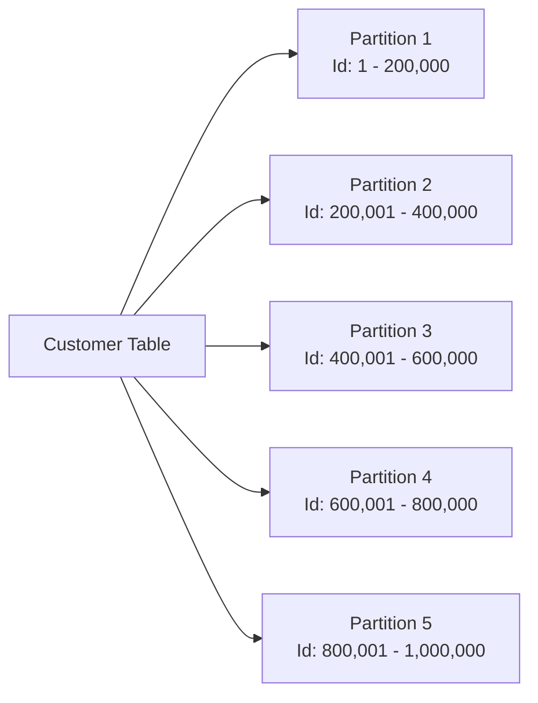

# Database Partitioning

As your table size grows, querying data from it becomes more and more slower. Even the index would grow larger, 
making its navigation slower. At this point, the best way to optimize your queries is by dividing your table
into smaller datasets which are operable independently. One of the way to do this is using **Partitioning**,
where you divide your table into smaller tables (partition) based on a partitioning key, which map the rows to their
respective partition.  

For example, we to execute the following query -> `SELECT name FROM Customer WHERE Id=655970` .
In original table, DB have to sequentially scan the whole table to fetch this row.
But if we partition our table on `Id` as following figure

The DB would directly jump to Partition 4 since it knows that `Id` -> $(600k,800k)$ belongs to that partition and
here it’ll only have to scan through 200k rows at max. 

The above example is known as **Horizontal Partitioning** where we slice table along the rows.
There’s a lesser popular version of partition known as  **Vertical Partitioning** which slices table along column, 
which you can use to slice column which are larger and lesser frequently accessed (like a blob).
This allows you keep access to rest of the columns quicker, as same page could now fit more rows.

However, efficiently utilizing partitions might not be as straight forward as implementing it.
You need to have an understanding over you data and queries, like frequently accessed data which could cause 
**hot partitions**, and determining queries which are crucial for performance.
And depending on these factors, decide the right partitioning strategy like:

- partitioning on a range of keys, (like dates or IDs) which is used ideal for data with natural ordering
- partitioning on a list of keys, (like region, category) which is ideal for discrete predefined data.
- partitioning on a hash of keys, to evenly distribute the data, reducing hotspots and improving performance

Along with it, you need to set up plans for maintenance and evolving partitions like automating partitioning
creating in case of range partitioning, and monitoring the performance and usage of each partition to identify
the imbalance and address them effectively. Following table briefly summarizes the pros and cons of using
partitioning.

|                     Advantage |                            Disadvantage |
| --- | --- |
| Improves query performance when accessing a single partition as it’ll have lot less rows then original. | Updates which moves row from one partition to another are slower. |
| Improves Sequential Scan and Index Scan as both underlying data structure are a lot less in size compared to original. | Inefficient Queries could scan all partitions if not used properly. This is a lot more slower |
| Easy to bulk import data by attaching partition | Schema changes can be challenging. |
| Archieve old data into seperate partition which can use cheaper storage. |  |
