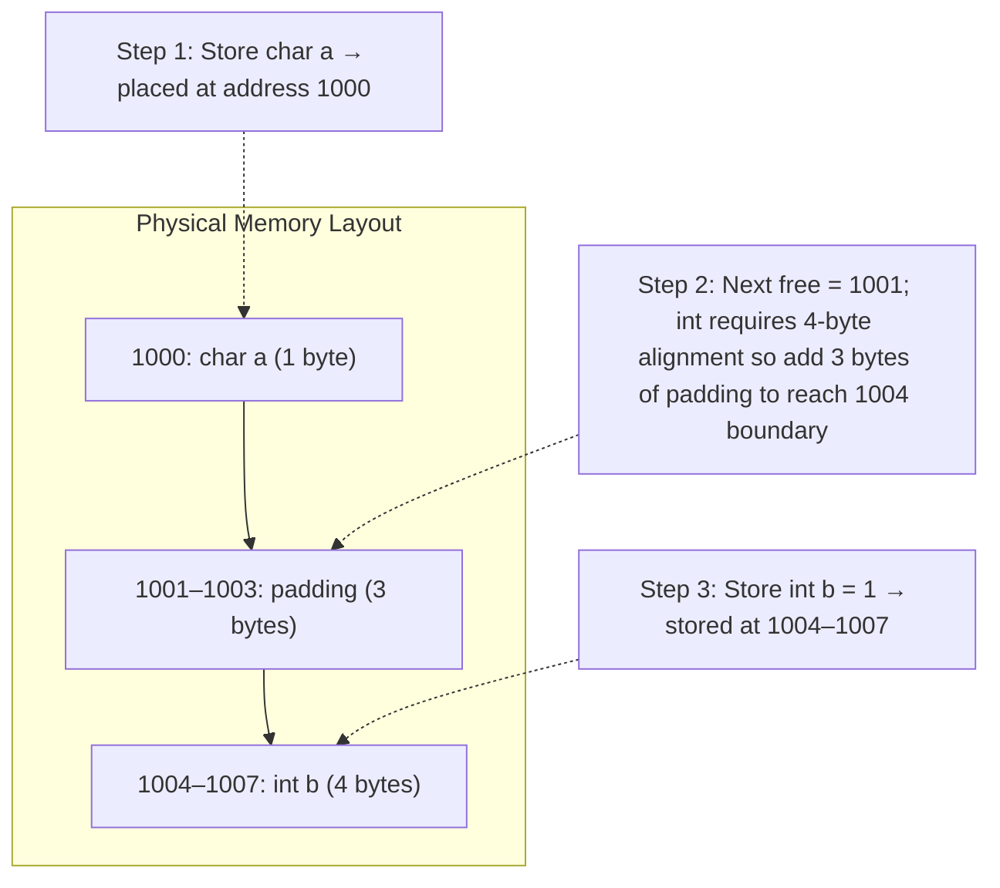
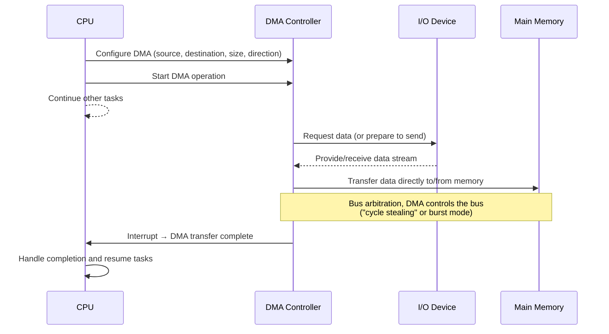

# Memory

Memory is a core component for computers which allows it to remember information for future use. Without memory, CPUs
won't be able to make sense of any opcode used for executing machine code, it won't be able to perform multistep
processing which requires storing intermediate results, and lastly it won't be nearly as fast as it’s now.
Technology like RAM/ROM provided CPUs with faster storage and retrival operations compared to other storage, but
the data is only persisted for the duration its supplied with power. This lead such a high adoption of RAM as memory
such that this technology has become synonymous with memory in computers. 

## Different kinds of memory

The core concept of memory is to allow byte addressability over its information, such access to all available addresses
are equivalent. But different requirements like speed, persistence lead to development of different kind of memories.
Below we'll discuss different kinds of memory and how they evolved over time.

- **ROM** (1) was designed so that it wouldn't lose its configuration even in absence of power, the tradeoff was it could 
  only store static data (2). This kind of memory is still used to store information like CPU opcodes(3), and firmware
  like BIOS/UEFI (any data which isn't changed normally). 
  {.annotate}
    1. Read Only Memory, non-volatile read only memory. 
    2. ROM stores data by physically encoding it into the hardware during manufacturing. The patterns of bits are 
       "burned in" using fixed wiring, programmed fuses, or permanently set transistors, so the data remains even without
       power and cannot be easily changed afterward.
    3. Opcodes are machine codes which are the lowest level of instruction understandable by a CPU. 

- **RAM** (1) technology allowed to reset its configuration electrically such that same circuit can be reused to stored
  different information. This allowed CPU to use this space as scratch board for its execution, where it can store
  temporary information like intermediate result from execution of an operation. 
  {.annotate}
    1. Random Access Memory, since you can access information using random addresses  


Further RAM can be divided into two categories based on their implementation and usage.

- **DRAM**(1),  used for general memory is a slower and cheaper RAM compared SRAM. It's cheaper because it's only uses
  1 Capacitor and transistor to build 1-bit memory. Information of each bit is stored as charge in capacitor, but 
  since capacitors leak charge over time, you need a mechanism to refresh the charge done using **Sense Amplifier**. 
  When **reading** a selected row, capacitor's tiny charge is shared on bitline which leads to a tiny change in voltage. 
  This change is detected by Sense Amplifier which amplifies it to corresponding 0 or 1. Since releasing charge would
  corrupt the state of capacitor, sense amplifier writes the value back (refreshes it). When **writing**, sense
  amplifier turns the bitline to 0 or 1, which forces the capacitor to charge or discharge for storing the new bit. 
  Since DRAM uses less electrical circuitry to make 1-bit, its more compact and cheap making it ideal for developing 
  large memory. But its less performant as it needs to refresh the charge regularly (~64ms) making it less idea for low
  latency parts.
  {.annotate}

       1. Dynamic RAM 


    ??? note "Evolution of DRAM"
        
        In Earlier days, DRAM was asynchronous. It didn't use the system clock due to which the CPU had to wait and insert
        delays, as it didn’t know exactly when DRAM would finish operations. This caused timing mismatches and inefficiency.    
        **SDRAM** was developed to address this issue by providing clocked, synchronous operation. Now it'd use the system bus
        clock, which made data transfers occur at precisely defined clock edges, so the CPU knows exactly when data will be
        ready. Because it’s synchronized, SDRAM can accept a new command every clock cycle 
        (even while previous ones are still in progress), greatly improving throughput.
        
        SDRAM still used only single rising edge of clock to transfer data, we’d double the rate of transfer if we can also use
        the falling edge of clock as well. This lead to development of **DDR SDRAM** (1). Overtime, DDR SDRAM evolved from 
        version 1 to 5. In **DDR4 SDRAM**,  we’d 8 pins where each pin could fetch 8 bits per I/O. This was designed to 
        maximize the caching in CPU which is a 64 bytes cache lines. So while we’re fetching certain data, we’d also fetch the 
        remaining portion in 64 bytes window and this is called burst. The issue with current RAM is that it can only be used
        by single core of CPU at a time, so it'd be a waste to use it on multicore CPU since all other core’s would’ve to 
        wait for currently accessing CPU. This was solved by **DDR5 SDRAM**, which doubled the bits fetched by  each pin to 
        16 bits per I/O. Now, you can divide the 64 pins into 2 sections to fetch 64 bytes (16x32) and each of these sections
        were called channels.
        {.annotate}
        
        1. Double Data Rate SDRAM

- **SRAM** (1), used in CPU caches  has much faster access than RAM. It stores data using flip-flops (2)
  , so it doesn’t require the constant refreshing that RAM does making it much faster. However, manufacturing SRAM is more 
  expensive and takes more space (3), so you can’t build large memories with it. This makes it ideal for small, 
  high-speed memory like L1, L2, and often L3 cache.  
   {.annotate}

     1. Static RAM  
     2. Made up of transistors
     3. 6 transistors to build 1 bit. 

## RAM Module


When we're installing RAM, we've mostly come across this kind of component.
{align=right}
Usually, it comes as **SO-DIMM**(1) which consists of 3 majors parts:
{.annotate}

1. Small Outline Dual In-line Memory Module

The **PCB** (1) with gold connectors and multiple layers of copper traces which provides connectivity 
b/w memory controller on PC motherboard and DRAM chips for signal routing(2), power, and ground planes.
{.annotate}

1. Printed Circuit Board
2. like **Address lines** to specify the input, **Data lines** for transferring data

Next, you can see multiple black ICs mounted on PCB, known as **DRAM chips**. 
Each DRAM chip stores a portion of the module’s total memory capacity.
Inside every DRAM chip, data is stored in memory cells arranged in Banks, Rows and Columns.

- **Banks** are independent memory region inside a DRAM chip, which allows parallelism: one bank can be precharging
  while another is reading/writing. Each bank is further divided into a table like structure with multiple rows and 
  columns, where each row must be opened (activated) before reading or writing. 
- **Rows** are horizontal slice of memory inside a bank. To read data from a row, the entire row needs to be activated 
  and pulled into row buffer/sense amplifiers. This design allow you to only **access data from 1 open row per bank** at a
  time, because switching to a different row requires, PRECHARGE (close the current row) and ACTIVATE (open a new row)
  commands. This is where “row hit” and “row miss” performance behavior comes from where
    - If the row is already open → row hit → fast read directly from row buffer.
    - If a different row is open → row miss → slow as it needs PRECHARGE and ACTIVATE operations.
- **Columns** represent the smaller divisions inside a row. After a row is activated, the read/write command specifies
  column address to pick the exact data word out of the row buffer. You can read multiple columns in a single burst-read
  operation (often burst length = 8).
- **Cells** are the fundamental storage unit of DRAM, build using a capacitor which stores the state (0/1) and 
  a transistor which controls the access to capacitor.

Lastly, a small **EEPROM** chip called SPD (1) found at center of module above image. 
It contains a small amount of non-volatile memory that stores configuration, timing, and identification data so the
motherboard knows how to correctly initialize and run the memory. 
{.annotate}

1. Serial Presence Detect


## Data Alignment

CPUs read data in fixed byte sized (1) blocks from its cache known as cache lines (2). For example,
if a CPU with 64-byte cache lines needs to load address 150, it fetches the entire 64-byte block from 
address 128–191. 
{.annotate}

1.  4-, 8-, 16-, or 32-byte
2. A cache line is the smallest block of memory that the CPU’s cache can load from RAM and store internally.

With this access pattern, if a variable lies across two cache lines, the CPU would need two memory accesses which is 
slower and more complex to handle. To solve this problem, data alignment was introduced.

With **Data alignment**, variables in memory are stored at addresses that are multiples of their size
(or their required alignment boundary). Example of typically aligned data type

| Data Type                  | Size     | Common Alignment |
|----------------------------|----------|------------------|
| `char`                     | 1 byte   | 1-byte aligned   |
| `short`                    | 2 bytes  | 2-byte aligned   |
| `int32`                    | 4 bytes  | 4-byte aligned   |
| `int64` / `double`         | 8 bytes  | 8-byte aligned   |
| SIMD types (e.g., 128-bit) | 16 bytes | 16-byte aligned  |

Check following diagram to see how alignment is done when storing variables, 



You might notice that padding in cache line would lower the utilization of each cache lines. 
{align=right}
Usage of padding is unavoidable since the performance boost provided by such alignment far outweighs this cost.
But you can minimize padding, by decision like, reordering fields inside a struct or designing data layouts 
manually for cache-line friendliness. Google used this technique to improve performance of Linux TCP/IP stack
by 40% by reordering internal structs ([blog](https://www.phoronix.com/news/Linux-6.8-Networking){target=_blank}). 

This alignment is managed by 3 cooperating layers:

1. **CPU at hardware level** defines rules for alignments like valid addresses for each instruction, alignment required 
   for each data type size, and if the CPU can handle misaligned access natively.
2. **Compiler** enforces the alignment when organizing memory during compilation by arranging address of various
   objects like variables, struct fields, stack frames and heap allocations.
3. When you allocate memory dynamically like using `malloc`, the C standard requires `malloc` to return a pointer
   suitable for storing any data type. Meaning it must be aligned to at least 8 or 16 bytes depending on platform. 
   So, the **OS** gives pages aligned to large boundaries (e.g., 4 KB) and **memory allocator** (1)
   returns aligned chunks (8, 16, or 32 bytes).
   {.annotate} 
   
    1. glibc, dlmalloc, jemalloc, etc.


## Memory Management with Virtual Memory

Using only physical memory directly to manage processes creates several significant limitations:

1. **Fragmentation**: Each process during initialization is provided a continuous block of memory for its operations. 
   As the process continues its execution, it’d allocate and deallocate memory which results in creating small gaps of
   unused memory. This leads to underutilization of memory, because even though we’ve enough free space, we don’t
   have a continuous block.
2. **Shared Memory**: implementing shared memory could poise security risk where one process can accidentally 
   (or maliciously) overwriting another’s memory.
3. **Isolation**: it’s difficult to isolate access to memory for different process as all data is present on same
   circuit
4. **Large Programs**: Physical RAM is finite and processes must fit entirely in RAM for their execution which limits 
   the number of process at a time. Worse Large applications may not run at all if there isn’t enough contiguous memory.

Virtual Memory was designed to overcome these limitations. It's simply a fake/virtual continuous address space which 
is mapped to real physical memory address on RAM. With this, you can allocate each process a continuous virtual address
which when accessed would be translated to physical address by CPU. This translation is done using **Page Table**(1) and 
**MMU**(2). 
{.annotate}

1. Data structure which maps virtual address to physical address, created by OS Kernel. Each Process has its own
   Page Table private to it.
2. Memory Management Unit, the component in CPU responsible for translating the virtual address to physical address.

This would solve all of above limitation:

1. Solve fragmentation by grouping discrete memory location and mapping them together to a continuous virtual memory 
   address.
2. To provide Shared Memory between two different process, we can simply map the page table such that it points to 
   same physical address. This has variety of use cases like 

     - avoid storage of duplicate data in memory, for example the code section of same program with multiple processes.
     - avoid reloading same libraries again, for example loading of `libc` library once and reusing the same memory 
       location in rest of the processes. You can see this mapping in linux using cat `/proc/[pid/maps` command. 
     - faster forking of new process/thread from multiprocessing and multi-threading by simply copying memory parent
       to the child process. When the child process writes to memory, it’ll be added at a separate location by updating
       the page table using this concept is called **CoW** (Copy on Write).
     - simple implementation of shared buffers in databases

3. Guaranteed Isolation of Physical memory for each process. Because the page table will only point to memory 
   accessible by its process and this Table lives in Kernel Space which makes it secure from tinkering by bad agents.
4. It also solves problem of limited memory by allowing OS to use more memory than the capacity of RAM. This is done
   using called **Page Swap**. Following diagram showcases how Page Swap is used to allocate space for new process
    ```mermaid
    sequenceDiagram
        participant Process
        participant OS as Kernel
        participant Mem as Physical Memory
        participant Disk as Swap Space
    
        Process->>OS: Request memory allocation
        OS->>Mem: Check available free frames
        Mem-->>OS: Not enough free memory
    
        OS->>OS: Select victim pages (replacement policy)
    
        OS->>Mem: Identify victim page frame
        Mem->>Disk: Write victim page to swap (if dirty)
        Disk-->>OS: Swap write complete
    
        OS->>Mem: Free the victim frame
        OS->>Disk: Read needed page from disk
        Disk->>Mem: Load required page into freed frame
    
        OS->>Process: Memory allocated successfully
        Process->>Process: Continue execution
    
    ```
   But when the swapped process returns for execution, Kernel needs to reload the swapped memory into RAM to for its 
   continued execution. This is done using **Page Fault**, which is explained below 
    ```mermaid
    sequenceDiagram
        participant Process
        participant CPU
        participant MMU as MMU<br/>(Memory Mgmt Unit)
        participant OS as OS<br/>(Page Fault Handler)
        participant Memory as Physical Memory
        participant Disk as Secondary Storage
    
        Process->>CPU: Execute instruction
        CPU->>MMU: Request virtual address translation
        MMU-->>CPU: Page Fault (page not in RAM)
    
        CPU->>OS: Trigger Page Fault Interrupt
        OS->>OS: Determine victim page (replacement policy)
        OS->>Memory: Mark victim page for eviction
        Memory->>Disk: Write victim page to disk (if dirty)
    
        OS->>Disk: Read required page into memory
        Disk->>Memory: Load page into freed frame
    
        OS->>MMU: Update Page Table (new mapping)
        OS-->>CPU: Return from interrupt
    
        CPU->>MMU: Retry memory access
        MMU->>Process: Provide physical address
        Process->>Process: Continue execution
    ```

**The tradeoff of using Virtual Memory**:

- Increased overhead and slower performance of memory. Virtual memory requires Page table lookups, 
  TLB (1) management, Page fault handling. When a page fault occurs, the OS must fetch data
  from disk — which is millions of times slower than RAM. This can significantly slow system performance.
  {.annotate}
  
    1. Translation Lookaside Buffer 

- When the system spends more time swapping pages in and out of disk than executing actual processes, it enters a state
  called **thrashing** which drastically reduces performance. This happens when either working sets don’t fit in RAM 
  or we're running too many processes simultaneously.
- Introduces higher complexity in OS and hardware. Virtual memory requires Page tables, TLB support, Sophisticated
  algorithms for replacement, allocation, protection. This makes hardware (MMU) and OS design more complex.
- Large processes require very large page tables. Maintaining and storing them consumes a lot of memory and CPU time
  (updating entries, context switching). Even optimized designs (e.g., multi-level page tables) add complexity.

## Direct Memory Access (DMA)

Earlier days, moving data between I/O devices(1) and memory would've to be done through CPU which involved reading a 
chunk of data from one side to CPU and copying it over from CPU to another side, and this process is repeated for
every piece of data. This is extremely slow and wastes CPU time, specially when moving large amount of data. 
But with DMA, the CPU can delegate the transfer, freeing the CPU to do other work.
{.annotate}

1. like disk controllers, network cards, sound cards, GPUs, etc.

DMA is a hardware feature that allows certain components of a computer (mainly I/O) to transfer data directly to or
from main memory (RAM) without involving the CPU for every byte or word.

Here’s the general flow of a DMA operation:


??? annotate "Bus Arbitration"
    Computers have multiple components that may want to read/write memory but only one can use the bus at a time,
    because the **memory bus** is a shared resource. **Bus arbitration** helps determines which device gets control of
    the system bus when multiple components want to use it at the same time. There are various arbitration strategies 
    depending on factors like fairness, stability and priority, the most commonly used strategy is 
    **Centralized Bus Arbitration**(1).
1. uses a dedicated chip (or circuit inside the chipset) that acts as the bus arbiter. The arbiter receives 
   requests from multiple devices and decides based on, priority levels, fairness algorithms and current bus load.

Since bus arbitration affects the working of CPU, DMA provide different mode of operations for different use cases:

1. **Burst Mode DMA** transfers an entire block at once which is fast but this would block the bus for longer duration,
   which blocks CPU from accessing memory.
2. **Cycle Stealing DMA** steals a bus cycle occasionally so the CPU can still work providing a balanced performance.
3. **Transparent DMA**: Runs only when CPU is not using the bus which makes transfer slow, but it avoids any 
   interference with CPU.


Modern systems which involves transferring huge amounts of data, like streaming high quality video, reading/writing large
files/network packets would consume 100% of CPU time if done manually. Using DMA in such systems is crucial as it
provides high throughput and low CPU overhead. But using DMA can be a security risk as it works directly with
Physical Memory Address. To protect memory from unauthorized DMA, use **IOMMU** (1) which limits what memory addresses
a DMA device can access.
{.annotate}

1. Input-Output Memory Management Unit


??? note "Analyzing memory usage in Linux using `top`"

    You can use `top` command in Linux to analyze memory usage. When executed, output at top of screen would be similar
    to following table.
    ```bash
    MiB Mem :  7890 total,  5320 used,  1020 free,   450 buff/cache
    MiB Swap:  2048 total,   220 used,  1828 free,    40 avail Mem
    ```
    The key fields are:
    
    - `total` -> total amount of system RAM or swap.
      - `used` -> memory currently in use by processes + OS/internal usage. Linux uses free memory for caching,
        so `used` often appears high which is normal.
      - `free` -> Memory not used for anything at the moment.
      - `buff/cache` -> Memory used for buffers (block device metadata) and Cache (file system cache). This memory is 
        reclaimable, meaning Linux can free it when applications need more RAM.
      - `avail Mem` -> estimated memory realistically available for new apps without swapping.
    
    Below which you'll see a list of running process with following headers
    ```bash
    PID  USER   PR  NI   VIRT   RES   SHR  S  %MEM  COMMAND
    ```
    
    - `VIRT` -> Virtual Memory Size, total virtual memory used by the process, including, code, data, shared libraries, 
      mapped files and swap if used. Not all of this is physically in RAM.
      - `RES` -> Resident Set Size, amount of actual physical memory the process is using.
      - `SHR` -> Shared Memory, is the portion of memory that is shared with other processes (libraries, shared memory segments).
      - `%MEM` -> percentage of physical RAM this process uses.