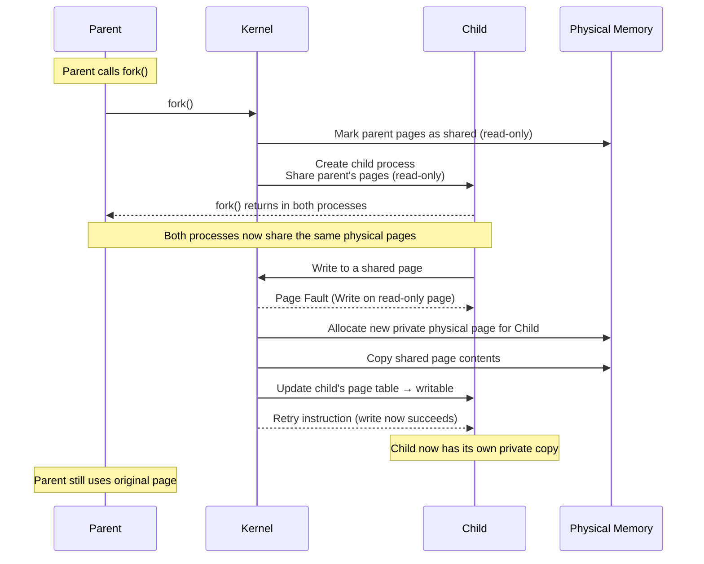
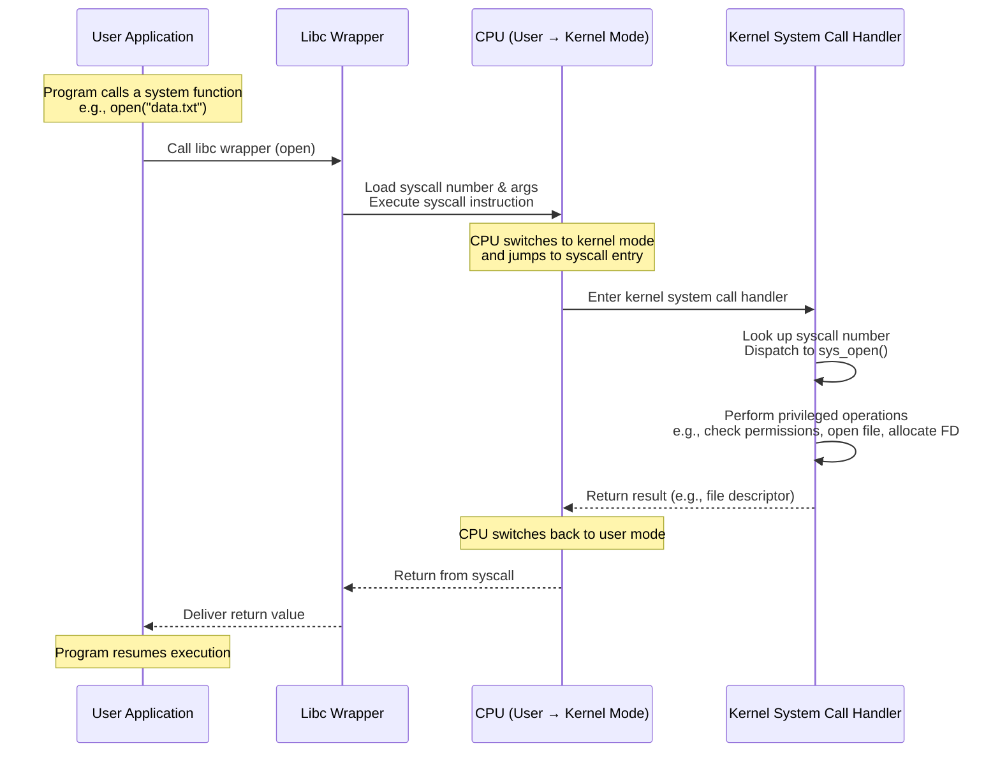
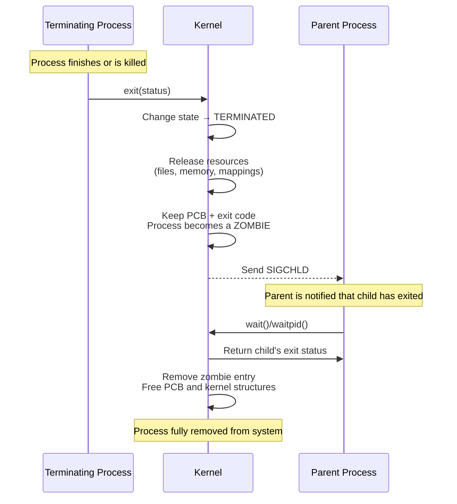

# Process Management

Earlier we'd discussed how programs are executed using [Processes](process.md#process), but there we only
went through how process are loaded, organized and executed in memory for execution. From last chapter
we learned how [CPU](cpu.md#instruction-cycle) executes those instructions in process memory space, where single 
CPU core only runs one process at a time. But in reality computers are made for multitasking,  where we can
run multiple tasks concurrently as if they're executed simultaneous. This is done by rapidly switching the 
CPU's attention between them, creating the illusion of continuity. While multitasking significantly boosts
efficiency and user productivity, it requires sharing resources like the CPU and memory between different processes
at the same time. This responsibility of sharing resources b/w multiple process is delegated to OS due to few
key reason:

- **Security**: Each process now run securely without worrying about malicious process overwriting their resource, 
  since is responsible for managing resource sharing. Process can only access the hardware through Kernel, which
  makes sure each process is only working in their bounds.
- **Scheduling**: Kernel makes sure that each process is scheduled as per defined scheduling algorithm, such
  that no single process can keep hogging the resource for themselves.
- **Stability**: Since process are isolated by Kernel, crash in one process wouldn't impact other running process.
  Additionally, Kernel can detect such crash and perform clean up of resources so that they're available for others.

Basically, delegating resource sharing for running multiple process to kernel allows system to run programs safely, fairly,
efficiently, and securely. To dive deeper, let's explain how and what key responsibilities does Kernel manage.

## Process Creation

The kernel is responsible for creating new processes (as explain [previously](process.md#process). In additional to 
that, Kernel stores additional metadata use for management of process in a protected space only accessible by Kernel.
This area of memory is called **PCB** (**Process Control Block**) and its created and maintained for each process.
It stores information such as Process ID (PID), CPU Context, scheduling information, page table, open file
descriptors, process state (running, ready or blocked).

??? note "Kernel Space"
    PCB shouldn't be confused with **Kernel Space** which is protected region of memory where only kernel can execute. 
    It's used for storing kernel code and data structure (like PCB), device drivers, system call handlers, or any 
    other critical instructions/information which needs secure execution. 

On Unix-like systems, a new process is usually created using `fork()`, which duplicates the parent process and then 
`exec()` replaces the child’s memory space with a new program. On Windows, `CreateProcess()` sets up a process directly.

## Scheduling

To decide which process gets the CPU and for how long, kernel uses a mechanism which picks process to run next and 
process to stop for switching with another. This mechanism is implemented by **scheduler**. Without scheduler, your
computer would only be able to run as many process as the number of cores in CPU at a time.     

This requires Kernel to manage additional metadata about process which tells its current state (like (1)). Since this
information is mainly used by scheduler, it's kept in PCB.  Also, the scheduler we're talking about here is CPU 
scheduler which ready process gets the CPU next, Kernel also have other kind of schedulers (2).
{.annotate}

1. **Ready** -> can run, waiting for CPU, **Running** -> currently on CPU, **Blocked** -> waiting for I/O, timer, lock, etc.
2. like **Job scheduler** used in multiprogramming to control the number of processes to admit into the system, **medium-term
   scheduler** which can temporarily swap out processes from RAM to disk (suspend) to free memory and later swap them back in.

### Context Switching

Once the scheduler picks a process and schedules it for execution in CPU, we need to save the CPU state of currently 
running process so that its execution can be resumed from where it left CPU when scheduled again. This responsibility
is handled by **dispatcher** which saves the CPU state of the currently running process into its PCB and then loads
the saved state of the next process from its PCB. This whole operation is called a **context switch**. 

Additionally during a context switch, the kernel must flush or reload certain CPU structures private per-process.
For example, flushing **TLB** and **PTBR** (Page Table Base Register) since TLB stores page table mapping for process 
and PTBR stores address pointing to page table. Since these components are used for virtual address translation, keeping older
mapping might lead to incorrect translation. As flushing and restoring TLB costs additional CPU cycles, modern CPUs
introduced **Address-Space Identifiers** which avoid flushing whole TLB unless necessary.

??? note "Address-Space Identifier"
    Many CPUs now support address-space identifiers (like `ASID` -> ARM and `PCID` → x86-64) which tag each TLB
    entry with the ID of the process’s address space. So instead of flushing the TLB, kernel assigns a unique `ASID`/`PCID`
    to each process. On a context switch, the CPU simply switches `ASID`/`PCID`. This keep TLB entries from different
    processes coexist safely.

Context switching is pure overhead as no useful work is done. If done infrequently it can lead to bad responsiveness
and wasted CPU cycles. 

### Scheduling Policies

Different users might have different requirements for running their workload. For example, an interactive systems will
prioritize response time to get fast response for a request while a batch systems requires higher throughput,
turnaround to get higher number of finished process per unit time.
??? note "Commonly used metrics"

    - CPU Utilization – keep CPU as busy as possible.
    - Throughput – number of processes finished per unit time.
    - Turnaround Time – time from process submission to completion.
    - Waiting Time – total time a process spends in the ready queue.
    - Response Time – time from request (e.g., key press) to first response.

To help with this, Kernel allows users to switch the scheduling algorithm. Few commonly used algorithm are:

- **FCFS** (First-Come, First-Served) in which processes are executed in arrival order. It's simple, but one long job
  delays all smaller ones. On average, this policy leads to higher waiting time per process.
- **SJF** (Shortest Job First) pick the process with the shortest CPU burst next. This minimizes average waiting time
  (proven) but introduces complexity for predicting burst time.
- **Priority Scheduling** allows each process to be associated with a priority number. Scheduler always picks the
  highest-priority ready process. This may cause starvation in low priority processes, which can be avoided by 
  gradually increase priority of waiting processes (ageing).
- **RR** (Round Robin) allocates each process a fixed amount of execution time. Processes are kept in circular ready 
  queue in which are scheduler adds process at the end as their time expires. This ensures fairness and responsiveness,
  but may require tuning in allowed time. If it's too small, we'll have too many context switches (overhead) and 
  too large value would reduce responsiveness.
- **CFS** (Completely Fair Scheduler) used by Linux tries to give each process a fair share of CPU time, 
  proportional to its priority. It maintains a balanced tree structure of runnable tasks, ordered by how 
  much CPU time they’ve used and the task that’s had the least CPU time runs next.

All these algorithms can be broadly categorized into two categories, **Preemptive** and **Non-preemptive**.
In **Non-preemptive** scheduling, once a process gets the CPU, it keeps it until it finishes or blocks. The scheduler
can't forcibly take the CPU away. It's simpler, but bad for responsiveness (a long job can block everyone).
It's counterpart, **Preemptive** scheduling allows kernel to interrupt a running process and give CPU to another. 
Usually done via a timer interrupt, it provides better responsiveness for interactive tasks. Almost all modern OSes
use preemptive scheduling.

To conclude, good scheduling keeps the system responsive, maximizes its CPU utilization, prevents resource starvation
and ensures fairness among processes.

## Memory Management

As previously discussed ([here](memory.md#memory-management-with-virtual-memory)), Kernel manages memory using Virtual
memory, Page tables for address translation. It also handles mechanism like 
[Page Fault](memory.md#memory-management-with-virtual-memory) where kernels brings needed page from disk into RAM, 
if swapped out memory is accessed.

### Copy On Write

Another concept we hadn't discussed previous is **CoW** (Copy On Write). It's an optimization technique used by
kernels during process creation where the child and parent process shares same physical memory pages. This dramatically
reduces memory usage because most processes never modify most of their inherited pages, while also increasing 
performance of child creation. To fully understand how this works, checkout below sequence diagram. 

## IPC

Many applications use multiple processes for different features, which all needs to coordinate with each other to
perform their work efficiently. For example, Browsers use different process for networking and rendering which all
needs to communicate with each other to load web pages seamlessly. But since processes are isolated, they can't access
each other’s memory/resources securely. To solve this, Kernel uses **IPC** which provides controlled, secure ways 
for processes to share data, coordinate actions, and work together. For example,

- Processes may need to **coordinate actions** like accessing a shared resource or ensuring tasks run in a specific order.
  For them, IPC provides synchronization tools such as **Semaphores**, **Mutexes**, **Signals** which helps in avoiding
  inconsistency and corrupting data.
- Processes may need to exchange information like a shell pipeline (ls | grep abc) passes data from one process to
  another or a microservices components exchange messages. IPC provides many mechanisms for fast and structured data
  exchange like **Shared memory**, **Pipes**, **Message queues** and **Sockets**. Here, shared memory is the fastest, as
  it lets processes communicate without extra copying.

All these mechanism also enforce permissions so that communication is only done through authorized processes. This way,
critical system processes can safely interact with others processes while preventing malicious  programs from
injecting harmful data into others.

## System calls

User processes can’t access hardware directly, they must request it through kernel using **system calls**(1). 
System calls act as the interface between user processes and the kernel which allow applications to safely request
services that only the kernel is allowed to perform, such as accessing hardware, managing files, creating processes,
or communicating over networks. 
{.annotate}

1. `open()` -> files, `malloc()` -> memory request, `read()` / `write()`, `socket()`

To protect hardware from direct access, OS runs program in two modes: **User Mode** and **Kernel Mode**. User programs
run in user mode, where the CPU restricts them from accessing hardware directly or modifying/executing anything in 
kernel space. But when application needs to access such restricted functionality, they can request it through available
system call which internally works as follows:

Note that system calls are slow compared to normal function calls due to mode switch from user-kernel-user during which
Kernel may flush TLB, check memory barriers, cache misses are likely, which reduces their execution. To improve 
performance various optimization techniques are used, like Linux introduced **vDSO** (virtual system calls), 
technologies like **io_uring**, etc.

To expose this system calls to user programs, different OS expose different interfaces. For example, 
Unix/Linux based OS provides **POSIX** based system calls standardized across Unix-like systems, while Windows system 
call are wrapped by Win32 API. Few commonly used system calls -> `fork()` to create a new process ,
`exec()` to load and run a new program, `mmap()` to map memory regions, `open()`/`read()` for File I/O.  

## Process Termination

During Proces Termination, Kernel needs to clean up and reclaim all resources used by the process. The termination
can be voluntary, when a process intentionally ends using syscall like `exit()`, or it could be involuntary where
the process is forced to exit due to unexpected errors or external kill.  Check the following sequence diagram for 
complete flow of termination

### Zombie Process

A zombie process is a process that has terminated, but still remains in the process table because its parent 
hasn't yet collected its exit status. When a process finishes, the kernel keeps basic information like the exit code,
metadata (PID, status) so that parent can retrieve the child's exit code by invoking `wait()/waitpid()` syscall.
This way, every parent can learn how its child died (exit code, signals) which would've lost if kernel removed the
whole process immediately.

If the parent never calls `wait()`, zombies accumulate. Example: a buggy program creates many children but never
waits for them which may cause system failure as it eventually run out of PIDs.

### Orphan Process

An orphan process is a process whose parent has terminated while the child is still running. The child can't just be 
left parentless, so the kernel reassigns the orphan to a safe parent PID 1 (`init`/`systemd`). Both `init` and `systemd`
has a special job of reaping orphaned zombie children as such orphan processes aren't harmful.
