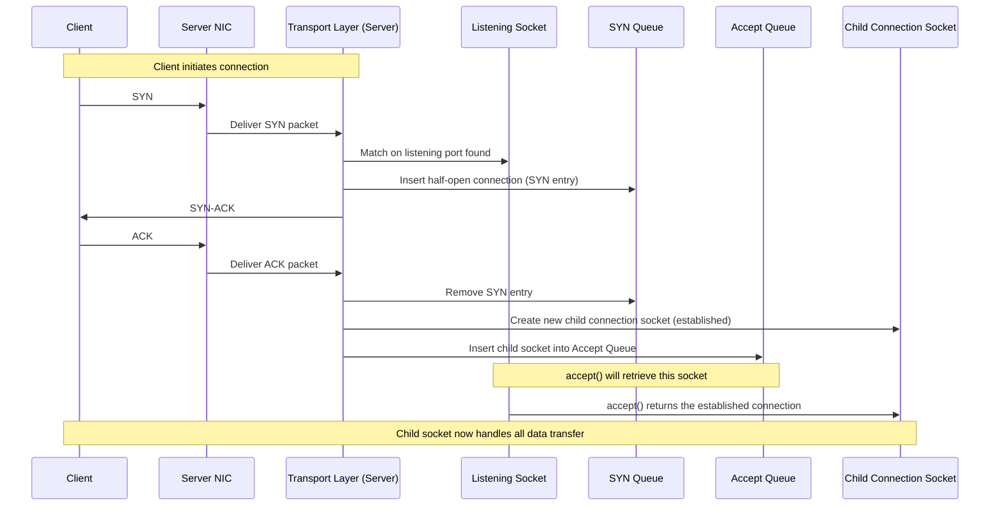
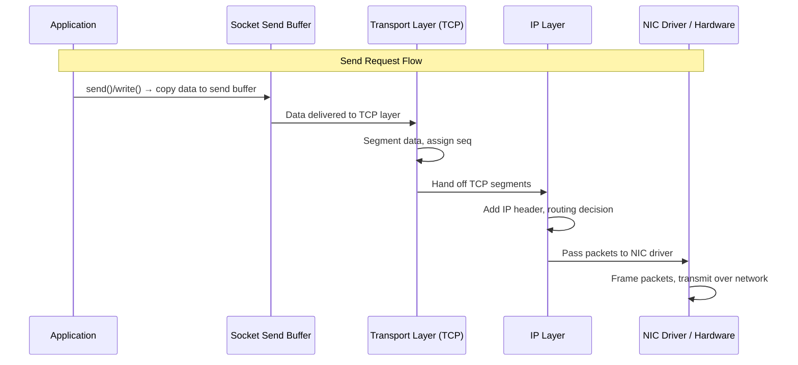
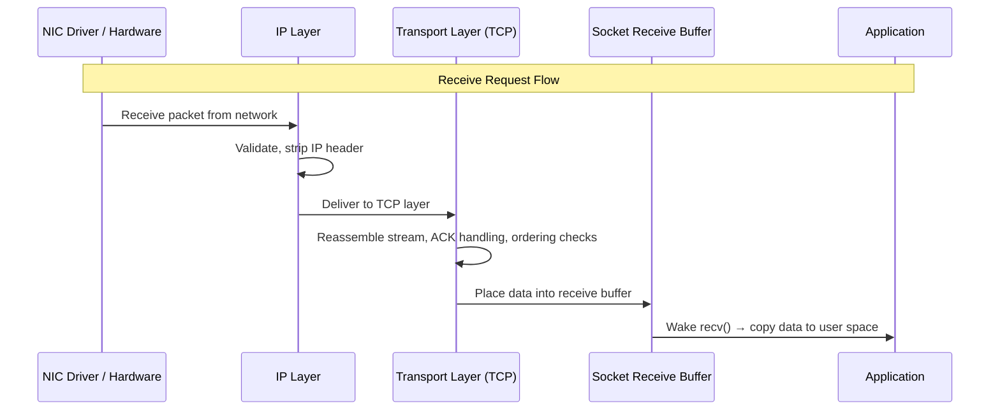
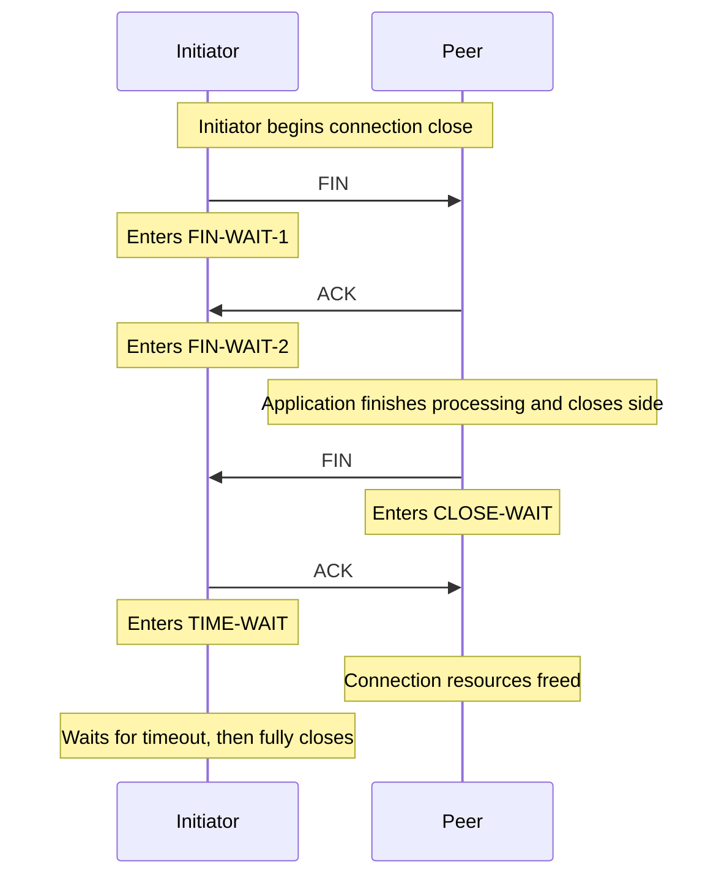

# Socket

??? note "History on networking standardization"
    During early days of networking, each computer vendor used their own implementation of networking system. Computers
    from different companies couldn't talk to each other, which became a problem when organizations wanted to communicate
    across mixed systems. This required setting standards which could be implemented across computer vendors so that
    communication b/w machines isn't limited. **TCP/IP** specification was one of first major steps towards this standardization,
    which introduced an open-source vendor-neutral protocol for communication. To describe all the major networking functions,
    a theoretical model called **OSI Model** was introduced which is considered as a reference model when implementing 
    newer protocols or understanding existing ones. IETF publishes RFCs describing how these protocols work, so that anyone
    can read or change or implement them. Along with the protocol, networking also needed standardization of hardware. For
    example, IEEE 802 standards used across Wi-Fi, Ethernet, Bluetooth provide standard way to authenticate and authorize a
    device into a network. **Sockets** are standardization on software side, which provides standard interface to work with 
    TCP/IP without worrying about underlying implementation.  Each of these standardization across internet is handled by
    open source organizations. 
    
    - IEEE -> physical standard
      - IETF -> Internet protocols through RFCs
      - names/numbers -> ICANN/IANA
      - security standards -> NIST, ISO, IETF 
      - app level standards -> W3C (web), IETF (mail, DNS)  

Sockets are logical construct to provide a standard, reliable way for programs to communicate with other
programs, either on the same machine or different machine across a network (like the internet) by providing an interface 
for program to access the OS’s networking stack. 

??? note "Briefly on computer networking"
    {align=right width=256px}
    
    To understand how computers communicate over network, we can use OSI Model which provides a simple reference model for
    various networking functions used in computer networking. To understand socket, we can just look at few top layers:
    
    1. **Application**: processes sends/receives complete app request parsed using application protocols like HTTP, FTP. 
    2. **Session**: Manages connection information, for example TCP is a stateful protocol which requires processes to establish
          a connection b/w hosts before sending/receiving app requests.
    3. **Transport**: implements TCP/UDP protocol which handles segmentation of data in packets/datagrams as per network 
          bandwidth, adds metadata like ports to identify process or headers for reliability.  
    
    For example, **TCP** protocol ( **T**ransmission **C**ontrol **P**rotocol) is a Layer 4 Protocol which allows a
    process to communicate with process on a remote host using IP+port combination. TCP prevent any data lose over network,
    as any packet which are lost during transmission are retransmitted. Due to this, it needs to maintain a state 
    making it a stateful protocol. The additional metadata used by this layer can range from 20-60 bytes per segment. 
    Also, before sending a request it needs to initialize an connection which is done by 3-way handshake. The connection
    is defined using an hash of SourceIP-SourcePort and DestIP-DestPort, which is mapped to a file descriptor in memory. 
    When receiving an segment, if we’ve this file descriptor the segment would be accept otherwise it would be dropped
    as we hadn’t formed any connection.
    
    The segments are sequenced and ordered to make sense of the data because on receivers end, the IP packets may 
    arrive out of order. It’s the job of receiver to order then using the provided sequence in their headers. Also, 
    every received segment is acknowledged. And if any segment is lost the receiver would request for it to be 
    retransmitted.

Technically they're C structs formed by combinations of sender+receiver IPAddress and port which can be used to listen
or send data over network using system calls. Sender/Receiver socket also needs to store their own IP because same 
computer can have multiple IP Addresses, each from different interfaces like NICs, loopback, or virtual IP Addresses.
In Linux, they're implemented as a file identifiable by a file descriptor(1), which can owned by the process and shared
with child process during fork. This design allows the app to read/write from the socket like a file, but the I/O is
routed to the network subsystem. 
{.annotate}

1. unique, non-negative integer that OS assigns to an open resource like file, socket, or other input/output (I/O) for 
   a process.

## Socket Management

With advancement in computer networking, one of the key idea ((1)) was the ability to execute commands across computer 
through network . **Client-Server architecture** utilized this idea suggesting separation of apps into two categories,
Client and Server which would divide the work into user facing and service provide. Now, the server can manage all the
heavy lifting required by application while providing a secure interface for client to access applications resource.
Today this architecture is used across majority of application in one place or another. We can use the operations used
by application build on client-server architecture to get a better understanding of socket management done by OS.
{.annotate}

1. concept is called RPC (Remote Procedural Call)

### Starting a listening port

To respond to a client request, server need to actively check for incoming requests. This can be done by using a 
**listening socket** over a specific port which can be used by client to send its request. 

!!! note "Steps to create a listening socket"
      1. `fd = socket(...)` -> create a socket which will be used by our process for listening. 
      2. `bind(fd, port, ...)` -> bind it to a specific LocalIP+port combination, so that all incoming traffic is only
         forwarded to socket having given IP+port combination.
      3. `listen(fd, ...)` -> Switch the socket to `LISTEN` state, this creates two new queues for establishing connection
         from external hosts.

After creating a listening port, NIC + routing table now consider this port valid for incoming SYN packets which makes 
the server ready to receive new connections.

### Establishing a Connection

When establishing a connection in TCP protocol, hosts have to complete a 3-way handshake.

??? note "SYN Flood Attack"
    Denial-of-service (DoS) attack that overwhelms a server by sending many initial connection requests (SYN packets)
    without completing the TCP handshake, which ends up flooding the SYN Queue. This has been now solves with timeout, 
    where the SYN request is removed if ACK isn’t received after certain time.

- The child socket is synonymously used with connection naming convention, as it contains all the data structures
required for communicating over connection, like send/receive buffers, metadata for transport protocols, etc.
- The capacity of **Accept queue** is specified using `backlog` parameters passed onto `listen` syscall. If the
  listening process doesn’t accept connection as frequently as they’re getting created, the Accept Queue would be 
  completely filled. As result, the Kernel wouldn’t be able to add more SYNed connections leading to outage for users.

### Connecting to a remote host

To connect to a remote host on listening port, you can create a socket object (`socket()`) and connect over respective
IP and listening port of remote host (`connect(remoteIP, remotePort)`). When you call `connect`, OS will randomly 
select an ephemeral port and initiate a 3-way handshake to establish a connection. After the connection is established,
the process resumes execution and the socket can be used to send and receive data. 

### Sending Request

Once connection is established on both client and server, either host can send data using `send()/write()` over respective
socket object.

During the transfer, Kernel also keep tracks various protocol based data to manages different protocol requirements.
For example, TCP requires retransmission to guarantee transfer of each packet, acknowledgements for received packets, 
flow control to avoid flooding receiver and congestion control to avoid flooding network.

### Receiving Request

??? note "Zero Copy"
    When working with send/receive buffer (lives in kernel space), data movement requires copying them from userspace 
    space to kernel space. For operations which transfer data from a file on disk, this involves multiple round trips of
    copying. In such cases Kernel provides few mechanism to avoid copying:
    
    - To transfer file from disk, you can use `sendfile` syscall which directly copies data filesystem into send buffer.
    - Point the send buffer directly toward the file to read the outgoing data from there on disk’s page cache (`MSG_ZEROCOPY`)

    Tradeoff: Can't apply additional processing (like compression and encryption) on outgoing data as doing it requires
     loading the data into userspace memory of process.

### Closing Connection

Since using connection occupies resources (like memory and file descriptor values), they need to be cleaned up once the application is done using them. This
is done using `close()` syscall, which can be invoked by either side which initiate a 4-way handshake in case of TCP.

??? note "Why `TIME-WAIT`?"
    `TIME-WAIT` state of socket ensures that all inflight segments are received to correct socket before its termination. 
    If we immediately terminated the socket, and the IP+Port combination is occupied by another socket - any inflight  
    packet would end up in wrong process breaching security of system.

## Socket Programming Patterns

More than frequently, the server’s listening process only accepts new connections and the accepted connection is
provided to a child worker process/thread for processing its requests. This architecture allows you to 
optimize and scale your server by organizing request handling as per required workload. Few of the commonly used patterns are:

1. **Single Listener - Single Worker Thread**: Standard pattern, where single thread is responsible for listening, 
   accepting and processing the incoming request. This could flood your Accept Queue, if your server is getting new
   connections more frequently that it's accepting.
2. **Single Listener - Multiple Worker Threads**: Main Thread is responsible for listening and accepting the request 
      but processing is offloaded to separate pool of thread. This way, you can keep your accept queue clear and unblocked
      for new connections. 
3. **Multiple Listener on same port** : Some systems like proxy, load balancers have requirement of accepting connection
      in huge number. To help with this, we can use `SO_REUSEPORT` flag when creating socket to allow multiple independent
      sockets to bind to the exact same IP address and port combination. With this, each listener can have its own listening
      socket and queues for accepting connection and the kernel will load balance incoming traffic over listening port b/w
      available sockets.

## Asynchronous IO

Most of the socket operations like read, write, accept are blocking operations, i.e. they block execution in CPU until
they receive some data in their respective buffers (receive, send, accept buffers). This leads to switch in CPU context
and slows down the process. 

For example, a program uses multiple connection for reading data sequentially. During execution, if any connection which
haven't received data in its buffer would block the execution, which leads to CPU context switch even if we’ve multiple
connection after this which could read data from their buffers. To avoid such situation, Kernel provides two approaches:

1. **Ready approach**: The kernel provides you with a function over socket to check if it’s ready for desired process.
   Using it, we can program our application such that we only read/write/accept when the socket is ready essentially
   avoiding blocking syscalls. This approach is implemented in Linux using `select` and `epoll` syscalls and `kqueue`
   in Mac. Note that these function only work over socket file descriptors.
2. **Completion approach**: Allow process to submit some I/O task to Kernel, which completes it on their behalf without
   blocking the execution. Once the task is completed the Kernel can notify the respective process, which can then
   pick up completed tasks and continue its execution. This approach is used in windows `IOCP` and `io_uring`. 

### Select

`select()` takes a collection of socket file descriptors for Kernel to monitor. When called, it’ll block the execution
until any of the provided socket is ready. With this, you can loop over socket with `FD_ISSET` to determine which FD is
ready. But this is slow since we’ve to now loop over all the sockets to determine ready socket. 
Few other limitation of `select`:
- internally uses lots of copying data between userspace and kernel.
- supports a fixed number of sockets for monitoring. 

### Epoll

`epoll()` is the standard API in Linux for doing async IO tasks. With `epoll` you register a list of
socket with kernel once (using `epoll_create` API). Now, the Kernel would maintain a data structure to keep upto date
information about which connection is ready when receiving data over connection. 
The app can now call `epoll_wait` and it’d return all the events of ready connection created by Kernel to userspace 
which can then be processed by the app. However, this API is only available in Linux platform. 

`epoll` also allows user to select its execution b/w level triggered or edge triggered. Level triggered epoll would 
send you notification continuously till they’re cleared while Edge triggered would only send you notification when
the state change from one value to another. One of the downside of using `epoll` is involvement of many syscalls which 
are expensive for cpu.

### IO Uring

**`io_uring`** uses shared memory between kernel and userspace so that the Kernel can directly fetch tasks from User
process and User process can directly fetch results from Kernels processing without adding the overhead of copying data
from one place to another and moving program counter. But this approach makes it less secure due to sharing space with
Kernel in userspace. 
Its usages involve using submission queue which can be provided with blocking tasks which needs to be completed. And
it provides Completion queue which provides you with the result of submitted tasks.

??? note "Cross Platform Async IO"
    All the above-mentioned APIs are a standard way for handling Asynchronous I/O, but they're only support in their
    respective platform subsystem. Like Linux uses epoll, Windows uses IOCP, MacOS uses kqueue. To unify all these, 
    we’ve a library called `lib_uv` which abstract the details of platform and provides a uniform API to perform async IO.  