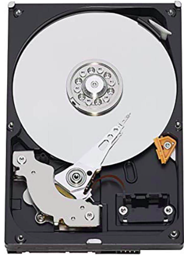
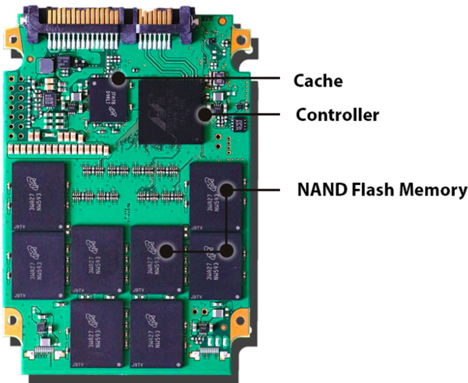

# Storage

Computers needed a place to save data and programs permanently, even when the power is turned off.
RAM is volatile where it loses data without power and ROM is too costly to store large amount of data. 
To solve this problem, storage disk were invented which evolved over time from punch cards to HDD/SSD to become
smaller, faster, more reliable, and able to hold far more data. Let's briefly discuss this evolution and technology.

## Storage Technologies

??? note "Key historical technologies"
    History of storing information and persist it even in absence of any external field began from **Punch Cards**. 
    Punch cards stored data as holes punched into stiff paper cards where each hole’s position represents a bit or
    character. A card reader shines light or uses mechanical sensors to detect the holes and the pattern of holes is 
    translated into digital data the computer can process. But punch cards were physically bulky, slow, and held only a
    tiny amount of data, which made them impractical as computers grew more capable. This was solved by invention of 
    **Magnetic tape**, which offered higher capacity and lower cost.
    
    **Magnetic tape** used a long plastic tape coated with magnetic material to stores data as patterns of magnetized regions.
    A read/write head moves over the tape, magnetizing areas to write bits or detecting magnetization to read bits. 
    However, magnetic tape allowed only sequential access, the tape had to be wound to reach a specific file which was too
    slow for interactive computing. To overcome this, **floppy disks** were developed, providing faster random access 
    and convenient portability.
    
    **Floopy Disk** used a thin magnetic disk sealed in a flexible plastic case where data was stored as magnetic patterns
    in circular tracks. A drive spins the disk while a read/write head hovers extremely close to the surface which provided
    random access by quickly moving to different tracks. 
    
    Another popular key technology during the period were optical media like **CD/DVD/Blu-ray** disc. The discs contain
    microscopic pits (indentations) and lands (flat areas) which could reflect light differently. This reflection pattern
    was interpreted as digital bits to store information. Laser light was used to read/write data, as such shorter-wavelength
    lasers meant higher-capacity of discs as light could be reflected from even smaller pits. This lead to development of 
    **CD** which used infrared laser, **DVD** using red laser and finally **Blu-ray** used blue-violet laser. 

### HDD

**HDD** (**Hard Disk Drive**) is one of the prominent technology used at this time for storage.
{align=right width=256px}

It's an electro mechanical storage device that stores data using magnetism on rapidly spinning disks called **platters**.
{align=right width=256px}
Inside the drive, there are one or more platter which spin at high speeds (1). A **head** is used to read/write data from
platters, which is attached to physical arm (**actuator**) to move it across the platter. 
{.annotate}

1. typically 5,400 to 7,200 RPM


Within the platter, data is organized using **tracks**, **sectors** and **cylinders** to allows fast and random access 
to data. When the operating system requests data to read/write data, the arm moves the head to 
correct track (**seek**) and waits for the correct sector to spin under the head (**rotational latency**).
This physical movement (1) is the main cause that limits HDD performance, as the drive spends time physically
repositioning parts before it can read or write data. Also, moving parts cause vibration and heat which causes wear and
tear over time.
{.annotate}

1. of spinning platters and moving arm

### SSD

**SDD**s (Solid State Drive) overcame this mechanical limitations of HDD, by using **NAND flash cell** technology.
Each cell can hold a charge that represents bits (0s and 1s) and you can combine multiple cells in series to store
multiple bits per cell (1) to increase storage density.
{.annotate}

1. SLC (single-level) -> 1 bit, MLC (multi-level) -> 2 bits, TLC (triple-level) -> 3 bits, and QLC (quad-level) -> 4 bits.
   {align=right}

??? note "Physics of NAND flash cell" 
    {align=right width=256px}
    NAND flash cell has a control gate and a floating gate, separated by a thin oxide layer. The floating gate can
    trap electrical charge which is used to store information as 0s and 1s. To fill charge in cell, you've to apply a
    high voltage at the control gate, which tunnels the electrons through the oxide layer and traps in the floating gate. 
    To check charge in cell, a read voltage is applied which causes current flow through the transistor. This current
    is measured to determine if the floating gate is charged. To remove charge from cell, you've to apply an erase
    voltage to release the trapped electrons.  

However, NAND flash cells has a physical limitation where data can only be written to an empty cell and the data in 
cell must be erased before being writing to it again. But operating individual cell at large scale proved to be far
more complex, slow and expensive making it physically infeasible. To overcome this limitation, 
cells where grouped in **pages** and pages into **blocks**. 

- **Pages** are the smallest writable/readable units which allowed faster random access and reduce write amplification
  compared to larger units. They're designed such that writing fewer bits at a time would make the SSD slower and
  more expensive.
- **Blocks** were design to erase data for making the cells reusable. But the physics of erasing flash cells lowered their 
  lifespan for storing data reliably. To reduce this wear down, erase is allowed at a large region at once named block.


With this data organization, SSDs can be efficiently used for storage purpose. To make it compatible for working
with OS, we could've implemented hardware drivers for SSD within kernel to help translate simple OS commands (1) into the complex
internal operations (2) needed for NAND flash. But instead of drivers, SSDs uses a hardware component for translation,
{align=right width=256px}
so that SSDs can evolve internally without changing how they interact with OS. This was component is called 
**controller**, which is a processor inside the SSD that manages all its operations. To map the logical address 
provided by OS to physical location, controller uses **FTL** (Flash Translation Layer) which hides the data layout of 
SSDs over simple LBA interface. Further, there are two different implementation of standard interface: **SATA** and **NVMe**.
{.annotate}

1. like READ, WRITE, DELETE
2. like Page read/write, Block erases

??? annotate "SATA and NVMe"
    **SATA** (1) relied on AHCI (2)  which let SSDs plug into existing systems designed for HDDs without requiring new 
    software. But as SSDs became faster, SATA interface became a bottleneck. To fix it, **NVMe** (3) was created to run 
    over PCIe (4), and 
    the commands were designed specifically for Flash storage while keeping same integration layer for OS.
1. Serial Advanced Technology Attachment
2. Advanced Host Controller Interface
3. Non-Volatile Memory Express
4. Peripheral Component Interconnect Express, high-speed interface for transferring data between the motherboard and
   expansion devices like SSDs, GPUs. The "Express" in the name indicates improved performance over older PCI standards. 


Further to understand internal working of SSD for different OS commands for CRUD and management operations, checkout
below admonition.

??? note "Read"
    ```mermaid
    sequenceDiagram
        participant OS as Operating System
        participant Ctrl as SSD Controller (FTL)
        participant NAND as NAND Flash
        
        OS->>Ctrl: Read(LBA)
        Ctrl->>Ctrl: Translate LBA -> physical page
        Ctrl->>NAND: Read(physical page)
        NAND-->>Ctrl: Return data
        Ctrl-->>OS: Send data
    ```

??? note "Write"
    ```mermaid
    sequenceDiagram
       participant OS as Operating System
       participant Ctrl as SSD Controller (FTL)
       participant NAND as NAND Flash
    
       OS->>Ctrl: Write(LBA, Data)
       Ctrl->>Ctrl: Find free (erased) page
       Ctrl->>NAND: Program new page with Data
       NAND-->>Ctrl: Write complete
       Ctrl->>Ctrl: Update LBA → new page mapping
       Ctrl-->>OS: Write success
    ```

??? note "Update"
    ```mermaid
    sequenceDiagram
       participant OS as Operating System
       participant Ctrl as SSD Controller (FTL)
       participant NAND as NAND Flash
    
       OS->>Ctrl: Write(LBA, New Data)
       Ctrl->>Ctrl: Lookup old physical page
       Ctrl->>Ctrl: Allocate new free page
       Ctrl->>NAND: Program new page with New Data
       NAND-->>Ctrl: Write complete
       Ctrl->>Ctrl: Mark old page as invalid
       Ctrl->>Ctrl: Update LBA → new page mapping
       Ctrl-->>OS: Update success
    ```
??? note "Delete/TRIM"
    ```mermaid
    sequenceDiagram
        participant OS as Operating System
        participant Ctrl as SSD Controller (FTL)
        participant NAND as NAND Flash
    
        OS->>Ctrl: TRIM(LBA Range)
        Ctrl->>Ctrl: Lookup physical pages for LBA range
        Ctrl->>Ctrl: Mark pages as "invalid" (no longer needed)
    
        Note over Ctrl: TRIM does NOT erase data immediately.<br>It only marks space as reusable.
        Ctrl->>Ctrl: Add invalid pages to GC candidate list to <br>erase in future Garbage Collection Cycle
        Ctrl-->>OS: TRIM acknowledged
    ```
??? note "Garbage Collection"
    ```mermaid
    sequenceDiagram
        participant Ctrl as SSD Controller
        participant NAND as NAND Flash
    
        Ctrl->>Ctrl: Identify block with invalid pages
        Ctrl->>NAND: Read valid pages from old block
        NAND-->>Ctrl: Valid data
        Ctrl->>NAND: Write valid pages to new block
        NAND-->>Ctrl: Data written
        Ctrl->>NAND: Erase old block
        NAND-->>Ctrl: Block erased (free)
    ```
??? note "Wear-Leveling"
    Wear leveling is an optimization technique to prevents any single block from reaching its erase-cycle limit too soon
    by moving hot-data blocks (data which is frequently updated) to cold-data blocks (data which is rarely updated).
    ```mermaid
    sequenceDiagram
        participant Ctrl as SSD Controller (FTL)
        participant NAND as NAND Flash
        participant WL as Wear-Leveling Engine
    
        Ctrl->>WL: Request block for new write
        WL->>WL: Check erase counts of all blocks
        WL->>Ctrl: Provide least-worn block
    
        Ctrl->>NAND: Write data to selected block
        NAND-->>Ctrl: Write complete
    
        Note over WL: Background Wear-Leveling (Static)
    
        WL->>WL: Identify cold data in low-wear blocks
        WL->>NAND: Read cold data from low-wear block
        NAND-->>WL: Return cold data
    
        WL->>NAND: Write cold data to higher-wear block
        NAND-->>WL: Write complete
    
        WL->>NAND: Erase original low-wear block
        NAND-->>WL: Block erased
    
        WL->>Ctrl: Updated block wear distribution 
    ```

SSDs have huge advantage in performance over HDDs mainly due to no involvement of mechanical apparatus. However, SSDs
have few of its own tradeoffs:

- SSDs architecture causes more write amplification like updating data requires writing to new pages, copying valid
  pages during garbage collection, and erasing blocks. So a small write can generate multiple internal writes.
- SSDs slow down when nearly full due large written blocks which causes more garbage collection leading to lower
  performance.
- **Wear-Leveling** is needed since each block can endure only a limited number of erase cycles, so the SSD spreads
  erasures evenly.

## Storage Management


We've already discussed how storage devices persists data internally, specially for [SSDs](storage.md#ssd). 
But programs rarely work with storage devices directly, instead OS provides different level of abstractions to simplify
communicating with storage. 
 
### LBA

From physical layer, storage devices expose themselves to the OS as a _linear array of fixed-size blocks_ known 
as **LBA** (Logical Block Address). As far as the OS is concerned, each LBA is a fixed size (1) unit for reading and
writing to storage. This design significantly simplifies storage interaction with OS while providing a simple interface
to storage devices to work with.
{.annotate}

1. typically 512 bytes or 4 kB

### Block Layer

Block layer sits b/w the filesystem (next layer) and storage device controller to performing crucial coordination 
work.

- Provides a unified interface to different block-based storage devices (like HDD, SSD, NVMe, USB drives). Each one
  of them can use their own protocol, but the block layer exposes a single common API for all of them allowing 
  Filesystems to work with all of them without knowing the difference. 
- Filesystems issue requests in filesystem blocks like `block 1234 (ext4 block)` which would correspond to multiple LBAs
  like `LBA range 50000–50007`. The block layer transforms this high-level filesystem request into a device-level 
  request with appropriate size.
- Request merging when filesystems issues multiple small request touching adjacent LBAs.
- Request splitting when a single large filesystem request exceeds devices maximum transfer size.
- Multiple processes may request I/O at the same time. Block layer handles this concurrency by using queues and proper
  scheduling which uses various algorithms (1) to ensure fairness and high throughput.   
  {.annotate}
  
    1. like **Elevator/SCAN algorithm** for HDDs to minimize head movement or ordering and merging writes in SSDs 

### FileSystem Layer

Working directly with blocks and LBAs is impossible for humans. Instead, filesystems were invented which used structures
similar to the one's we use in daily life to organize information (like (1)).
{.annotate}

1. files, directories, naming, permissions, timestamps and other metadata

It's primary role is to provide various operations to manage these structures, and translate them into
block operations for underlying abstraction layer. For example, `read("notes.txt")` operation would cause the filesystem:

- name lookup to find the directory containing the file
- metadata lookup to find the **inode**
- block mapping to find the range of LBAs storing the file.

Filesystem organizes blocks into data structures like,

- **Directories** -> map names to files
- **Inodes** -> Store metadata on file
- **Data blocks** -> Store file contents 
- Free space maps -> to find unused blocks 
- Allocation groups / extents -> to efficiently handle large files.

??? note "Simple Visualization of filesystem organization"
    ```mermaid
    flowchart TD
    
        subgraph DIR[Directory Structure]
            D1["Entry: fileA → inode #10"]
            D2["Entry: fileB → inode #20"]
            D3["Entry: notes → inode #30"]
        end
    
        DIR --> I10
        DIR --> I20
        DIR --> I30
    
        subgraph INODES[Inode Table]
            I10["Inode #10<br/>size, owner, timestamps,<br/>permissions, block pointers"]
            I20["Inode #20<br/>metadata + block pointers"]
            I30["Inode #30<br/>metadata + block pointers"]
        end
    
        I10 --> B1
        I10 --> B2
        I10 --> B3
    
        I20 --> DB1["Direct Block"]
        I20 --> IB1["Indirect Block"]
        IB1 --> IB1_1["Data Block A"]
        IB1 --> IB1_2["Data Block B"]
    
        I30 --> C1["Content Block 1"]
        I30 --> C2["Content Block 2"]
    
        subgraph DATABLOCKS[Data Blocks on Disk]
            B1["Block 100"]
            B2["Block 101"]
            B3["Block 102"]
            DB1["Block 200"]
            IB1["Block 300 (Indirect Block)"]
            IB1_1["Block 301"]
            IB1_2["Block 302"]
            C1["Block 400"]
            C2["Block 401"]
        end
    ```

This allows filesystem to allocate blocks efficiently while maintaining consistency and durability. It ensures this by using 
allocation algorithms like **Extents** which reserves contiguous ranges of blocks for a file, using B+ trees to 
keep track of free space, using **Journals** to recover from crashes and **Copy-on-write** to avoid overwriting data in-place  
Depending on different requirement, various filesystems (like (1)) came to as computers and their application evolved
over time. 
{.annotate}

1. FAT32, ext4, NTFS, XFS, btrfs

Few popular filesystems used in OS during this time, 

- **ext4** (Fourth Extended File System) is most commonly used filesystem for Linux distributions, built for 
  performance and reliability. 
- **NTFS** (New Technology File System) is default for Windows, offering reliability (journaling), security 
  (permissions, encryption), compression, and supports large files/volumes.
- **APFS** (Apple File System) for macOS/iOS, is optimized for SSDs with features like cloning, space sharing, and 
  strong encryption.

### Virtual FileSystem Layer

All different filesystems behave differently internally. To hide these differences, the kernel uses the VFS layer which 
provides a common API for all filesystems. This allows you to mount any filesystem underneath and work with file and 
directory in a standard way.

### Application Layer

Finally, at the top, we have the familiar interface (like (1)), which interact with the VFS, and passes requests to
the filesystem, which translates them into block operations, which are then sent to the block layer, 
which sends LBAs to the device.
{.annotate}

1. files, folders, paths, open, read, write, delete, copy/paste


??? note "Summary of Storage Layers"
    ```mermaid
    sequenceDiagram
        autonumber
    
        participant APP as Application
        participant VFS as VFS Layer
        participant FS as Filesystem (ext4/NTFS/XFS)
        participant BLK as Block Layer<br/>I/O Scheduler
        participant DRV as Device Driver<br/>(SATA/NVMe/SCSI)
        participant DEV as Storage Device<br/>(HDD/SSD)
    
        APP->>VFS: read("fileA", offset, size)
        VFS->>FS: Lookup file path<br/>Resolve filename → inode
        FS->>FS: Translate file offset → filesystem block
        FS->>BLK: Submit BIO request<br/>(read block X)
        BLK->>BLK: Merge & schedule requests<br/>Apply I/O scheduler
        BLK->>DRV: Dispatch request<br/>(READ LBA range)
        DRV->>DEV: Issue protocol command<br/>(READ LBA N to N+K)
        DEV-->>DRV: Return data
        DRV-->>BLK: Complete I/O request
        BLK-->>FS: Return data buffer
        FS-->>VFS: File data
        VFS-->>APP: read() returns with data
    
    ```