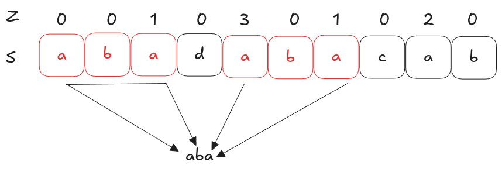

---
tags:
  - ZFunction
hide:
  - toc
---

# Z Function Pattern Matching

Reference: [Tushar Roy's YouTube Explanation Video](https://www.youtube.com/watch?v=CpZh4eF8QBw){target=_blank}

For a string `S`, the Z-array stores information about prefix matches such that,
{==
$Z[i] =$ length of the longest substring starting at position `i` that matches the prefix of `S`. 
==}
{loading=lazy width=400vw align=right}
That means, If $Z[i] = k$ ⇒ $S[i:i+k] == S[0:k]$. For example,

This can be used for matching a pattern `P` in text `T` by combining both using a delimiter (`P$T`) which doesn't appear
in either strings and the Z value which is same as length of `P` tells the match. The real index in `T` where this 
pattern appears is `i-len(P)-1`. 

Reason why this algorithm is popular is because it matches the pattern in $O(n)$ time and space, where `n` is length 
of string. 

## Algorithm to compute Z-array

When solving with brute force, we will just iterate over `S` and compare matching prefixes for each character.
{loading=lazy width=400vw align=left} For example, refer to image on left. However, this isn't 
linear time as we're repeating comparison when for characters in substrings where match has been found. 

To make this linear time, we can reuse already computed values from Z function. To do this efficiently, maintain a
window `[L, R]` (called a **Z-box**) => `S[L:R]` matches the prefix of `S`. For index `i`

- If it's outside matched window (`i>R`), we've to compute the Z values through comparison and maintain our window.
- Otherwise, if `i` is within window (`i<=R`) we can use precomputed values. 
  {loading=lazy width=400vw align=left} For example, our window would be expanded
  to `aba` when matching prefix for `a`. Now when we want to match prefix for `b` in this window, we can directly use
  precomputed Z value from `i-L`. **But** this is only true for prefixes which can be formed within our window i.e.
  length of prefix => `Z[i-L] < R - i + 1`. Otherwise, we'll continue expanding the match beyond R manually. 

??? note "Pseudocode in Python"
    ```python
    def compete_z(S):
        n = len(S)
        Z = [0]*n
        L = R = 0
        
        for i in range(1, n):
            if i > R: # Expand window and compute from scratch
                L = R = i
                while R < n and S[R] == S[R-L]:
                    R+=1
                Z[i] = R-L
                R-=1
            else:
                k = i-L
                if Z[k] < R-i+1: # Within window, reuse precomputed results
                    Z[i] = Z[k]
                else: # Outside window, adjust and recompute.
                    L = i
                    while R < n and S[R] == S[R-L]:
                        R+=1
                    Z[i] = R-L
                    R-=1
        return Z
    ```

---

Given this, Z-function is best when you want to do multiple prefix-based pattern matches. Other common algorithms for
pattern match in string includes: KMP, Rabin-Karp which you can look up further
