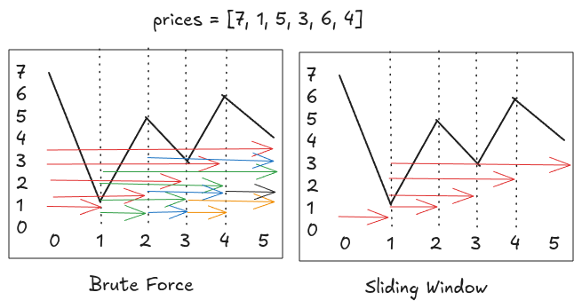

---
tags:
  - LC_Easy
  - Dynamic Programming
  - Sliding Window
  - Neetcode150
hide:
  - toc
---
# 121. Best Time to Buy and Sell Stock

[Problem Link](https://leetcode.com/problems/best-time-to-buy-and-sell-stock/description/){target=_blank}

{loading=lazy width=400vw align=right}
To compute maximum profit, you've to buy at minimum and sell at maximum with condition that you've to sell after buying.
Brute force method is to compute profit for every window (using left and right limit as buy and sell) using 2 loops
resulting in $O(n^2)$ time. Above Brute force is a general solution which considers combination of every possible
window, but we can optimize it by only including windows relevant to our solution.

Think of the windows indicated by its  left and right bounds using two pointers $l$ (buy day) and $r$ (sell day) respectively.
To compute maximum profit, we can slide this window over relevant end points to gather all optimal windows while ignoring
unwanted windows which wouldn't result in any profit. This involves moving $r$ from left to right, and comparing
$price[l]$ and $price[r]$ as follows:

- If $price[r] > price[l]$, the current window yields a valid profit, so we update the maximum profit and continue 
  expanding the window by moving $r$.
- If $price[r] \le price[l]$, the window is invalid because buying at $l$ can never lead to a better profit than buying 
  at $r$. In this case, we move $l$ to $r$, since any intermediate buy day between the old $l$ and $r$ would produce a smaller
  profit than what we’ve already considered.

This way, by always keeping $l$ at the minimum price seen so far and scanning $r$ once, we efficiently ignore non-profitable and 
suboptimal windows while computing the maximum profit in a single pass.

??? note "Runtime Complexity"
    <b>Time</b>: $O(n)$, as we're only considering each value in array once.
    
    <b>Space</b>: $O(1)$, constant space from variables.


=== "Python"

    ```python
    --8<-- "docs/DSA/neetcode150/src/py/best_time_to_buy_and_sell_stock.py"
    ```

=== "Go"

    ```go
    --8<-- "docs/DSA/neetcode150/src/go/best_time_to_buy_and_sell_stock.go:2"
    ```