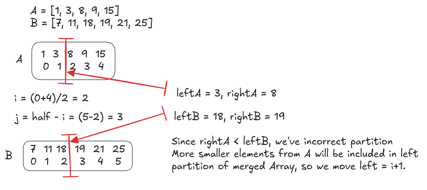

---
tags:
  - Binary Search
  - LC_Hard
  - Neetcode150
hide:
  - toc
---
# 4. Median of Two Sorted Arrays

[Problem Link](https://leetcode.com/problems/median-of-two-sorted-arrays/description/){target=_blank}

We can find the median of a single sorted array in $O(1)$ time by directly computing the middle indexes. However, this
problem requires finding the median of two sorted arrays without merging them, while achieving a time complexity better
than $O(m+n)$.

Instead of merging, we apply binary search on the smaller array to find a valid partition between the two arrays such 
that:

- The total number of elements on the left side equals the total number on the right side (or differs by one).
- All elements on the left partition are less than or equal to all elements on the right partition.

{loading=lazy width=600vw align=right}

Let the partition index in the first array be $i$, and in the second array be $j$, where  $i+j= {m+n+1 \over 2}$.
This ensures the left partition contains the correct number of elements. Using binary search, we adjust $i$ until
$nums1[i - 1] \le nums2[j]$ and $nums2[j - 1] \le nums1[i]$. Once a valid partition is found:

- If the total length is odd, the median is the maximum element on the left side.
- If the total length is even, the median is the average of the maximum of the left side and the minimum of the right
  side.

To optimize the binary search runtime, you can perform it on smaller array.


??? note "Runtime Complexity"
    <b>Time</b>: $O(log \min(m,n))$

    <b>Space</b>: $O(1)$


=== "Python"

    ```python
    --8<-- "docs/DSA/src/py/median_of_two_sorted_arrays.py"
    ```

=== "Go"

    ```go
    --8<-- "docs/DSA/src/go/median_of_two_sorted_arrays.go:4"
    ```