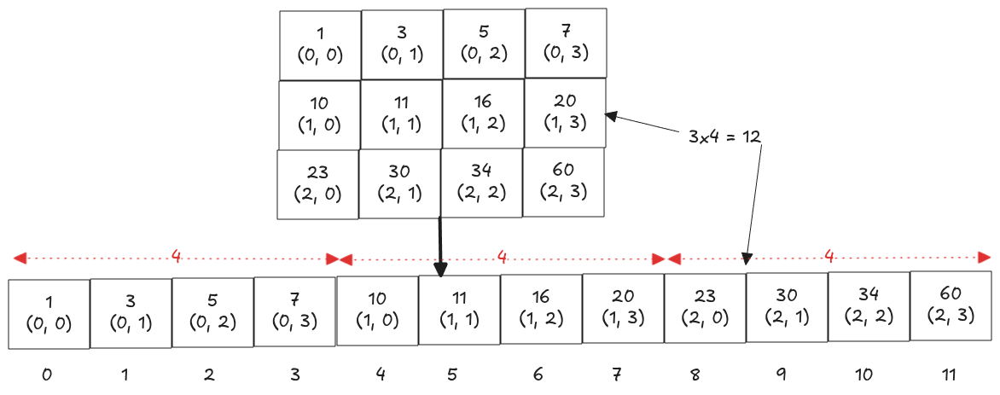

---
tags:
  - Binary Search
  - LC_Medium
  - Neetcode150
hide:
  - toc
---
# 74. Search a 2D Matrix

[Problem Link](https://leetcode.com/problems/search-a-2d-matrix/description/){target=_blank}

{loading=lazy width=800vw align=right}

The key idea is to treat the 2D matrix as a 1D array, which reduces the problem to a classic binary search. 
This conceptual flattening is illustrated on the right. Once flattened, we map an index $k$ in the 1D array back to its
corresponding $(row,col)$ position in the matrix.

For a matrix of dimensions $m\times n$, the mapping from index $k$ to $(row,col)$ is:

- $row=floor(k\div n)$, since each row contains $n$ elements.
- $col=k\mod n$, which gives the position within the current row after accounting for complete rows.

??? note "Runtime Complexity"
    <b>Time</b>: $O(logn(mn))$, Total search space is $mn$, which we're reducing by half in each iteration

    <b>Space</b>: $O(1)$, constant variables


=== "Python"

    ```python
    --8<-- "docs/DSA/src/py/search_a_2d_matrix.py"
    ```

=== "Go"

    ```go
    --8<-- "docs/DSA/src/go/search_a_2d_matrix.go:2"
    ```