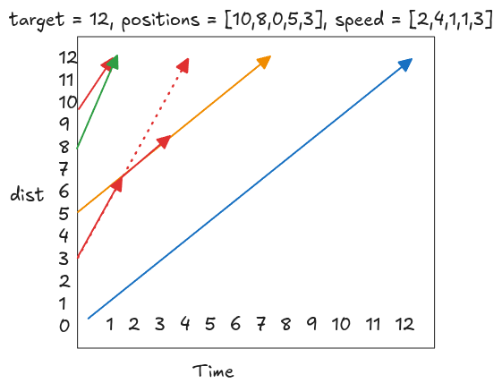

---
tags:
  - Stack
  - Monotonic Stack
  - LC_Medium
  - Neetcode150
hide:
  - toc
---
# 853. Car Fleet


[Problem Link](https://leetcode.com/problems/car-fleet/description/){target=_blank}

Each car moves toward the target at a constant speed. A faster car may catch up to a slower car ahead of it, but once
they meet, they form a fleet and continue together at the slower speed.
{loading=lazy width=400vw align=right}

If a car behind would reach the target earlier than or at the same time as the car ahead, it must catch up respective
cars before the target and therefore becomes part of the same fleet. This turns the problem into comparing arrival 
times, not positions over time.

Since the car ahead controls the pace, we sort them by position in descending order, so we process 
cars closest to the target first. For each car, compute the time to reach the target: $time = (target - position) / speed$.
To track the arrival time for each fleet, we can use a stack where each element in the stack represents the arrival 
time of a fleet. When processing cars from closest to farthest:

- If the current car’s arrival time is less than or equal to the time at the top of the stack, it will catch up and 
  merge with that fleet.
- Otherwise, it forms a new fleet and its time is pushed onto the stack.

This works because once cars are sorted by position, a car can only interact with the fleet immediately ahead of it.

??? note "Runtime Complexity"
    <b>Time</b>: $O(nlogn)$, since we used sorting

    <b>Space</b>: $O(n)$, from stack

=== "Python"

    ```python
    --8<-- "docs/DSA/neetcode150/src/py/car_fleet.py"
    ```

=== "Go"

    ```go
    --8<-- "docs/DSA/neetcode150/src/go/car_fleet.go:4"
    ```