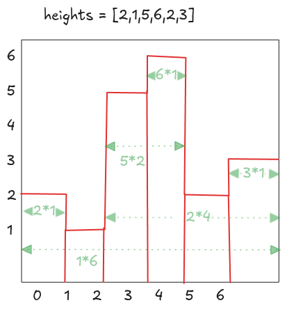

---
tags:
  - Stack
  - Monotonic Stack
  - LC_Hard
  - Neetcode150
hide:
  - toc
---
# 84. Largest Rectangle in Histogram

[Problem Link](https://leetcode.com/problems/largest-rectangle-in-histogram/description/){target=_blank}


{loading=lazy width=400vw align=right}

Largest Rectangle in histogram would be selected from the largest rectangles using each individual bars.
Maximum rectangle for each bar can found by limiting height of rectangle to current bar, and finding the widest width
possible to the left and right.

The width for a given bar is bounded by the nearest bar with a smaller height on both sides. Any taller or equal bar 
can be included in the rectangle, but a smaller bar stops the expansion. A brute-force approach for finding this width 
could be expanding left and right for every bar to find these boundaries, but doing this repeatedly for all bars 
results in $O(n^2)$ time complexity with constant extra space.

We can optimize this by precomputing the indices of the nearest smaller bar for each index in $O(n)$ time using a 
stack.  The idea is to maintain a monotonic increasing stack of indices, which allows us to efficiently find nearest
smaller elements.

---

??? note "Pseudocode"
    Maintain a stack where the heights corresponding to indices are in increasing order. For each index:

    - While the stack is not empty and the height at the stack's top index is greater than or equal to the current 
        height, pop from the stack. 
    - After popping, the new top (if it exists) represents the nearest smaller bar. 
    - Store this index in an auxiliary array. 
    - Push the current index onto the stack so it can serve as a boundary for future bars.

    This approach gives us $O(n)$ time and space complexity

??? note "Runtime Complexity"
    <b>Time</b>: $O(n)$, single pass on array, for precomputing arrays and max area

    <b>Space</b>: $O(n)$, from left, right arrays and stack which can grow upto size of $heights$  

=== "Python"

    ```python
    --8<-- "docs/DSA/neetcode150/src/py/largest_rectangle_in_histogram.py"
    ```

=== "Go"

    ```go
    --8<-- "docs/DSA/neetcode150/src/go/largest_rectangle_in_histogram.go:2"
    ```