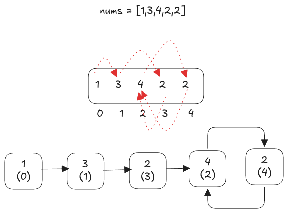

---
tags:
  - Linked List
  - Two Pointers
  - Binary Search
  - LC_Medium
  - Neetcode150
hide:
  - toc
---
# 287. Find the Duplicate Number

[Problem Link](https://leetcode.com/problems/find-the-duplicate-number/description/){target=_blank}

To solve this problem without modifying the array and using constant extra space, we treat the array as a linked list
where each index points to the value at that index.

Since the values range from 1 to n, there must be a duplicate, which creates a cycle in this implicit linked list. 
To detect this cycle, we use Floyd’s Tortoise and Hare algorithm.
{loading=lazy width=400vw align=right}

In the first phase, we initialize two pointers, slow and fast, both starting at index 0. On each step, slow moves one 
step forward, while fast moves two steps forward. If a cycle exists, the two pointers will eventually meet inside the 
cycle.

Once the pointers meet, we start the second phase to find the entry point of the cycle, which corresponds to the 
duplicate number. We reset one pointer to the start and move both pointers one step at a time. The point where they 
meet again is the duplicate value.

Finally, we return this value as the answer. This approach runs efficiently while satisfying the problem’s constraints.

??? note "Runtime Complexity"
    <b>Time</b>: $O(n)$

    <b>Space</b>: $O(1)$


=== "Python"

    ```python
    --8<-- "docs/DSA/src/py/find_the_duplicate_number.py"
    ```

=== "Go"

    ```go
    --8<-- "docs/DSA/src/go/find_the_duplicate_number.go:2"
    ```