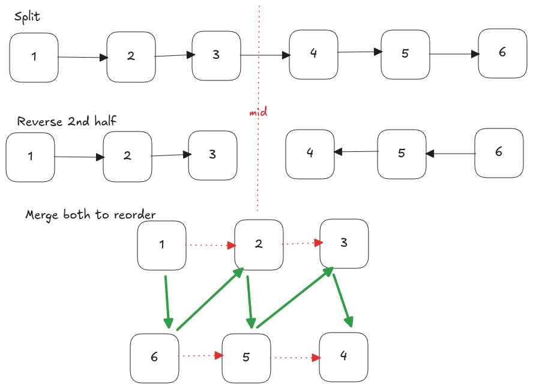

---
tags:
  - Linked List
  - Two Pointers
  - Stack
  - LC_Medium
  - Neetcode150
hide:
  - toc
---
# 143. Reorder List

[Problem Link](https://leetcode.com/problems/reorder-list/description/){target=_blank}

To solve this problem in-place, we first use the **slow and fast pointer** technique to find the middle of the linked 
list.
{loading=lazy width=512vw align=right}
When the loop ends, `slow` points to the middle node.

Next, we split the list into two halves by setting `slow.next = None`. We then reverse the second half of the list
using a standard single-pass reversal, keeping track of the previous and next pointers.

Finally, we merge the two halves by alternating nodes from the first half and the reversed second half. During this 
process, we store the next pointers of both lists before re-linking, ensuring that no nodes are lost. The reordering 
continues until all nodes from the second half are merged back into the list.

---

??? note "Runtime Complexity"
    <b>Time</b>: $O(n)$

    <b>Space</b>: $O(1)$


=== "Python"

    ```python
    --8<-- "docs/DSA/src/py/reorder_list.py:8"
    ```

=== "Go"

    ```go
    --8<-- "docs/DSA/src/go/reorder_list.go:2"
    ```