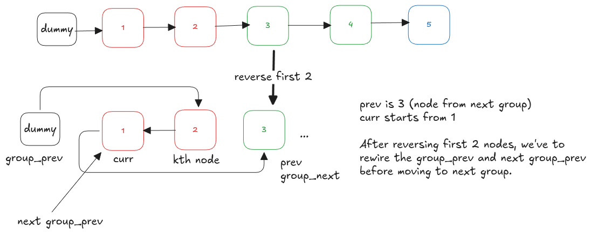

---
tags:
  - Linked List
  - LC_Hard
  - Neetcode150
hide:
  - toc
---
# 25. Reverse Nodes in k-Group

[Problem Link](https://leetcode.com/problems/reverse-nodes-in-k-group/description/){target=_blank}

This problem requires reversing nodes of a linked list in groups of size $k$, while leaving any remaining nodes 
(fewer than k) unchanged. Since the list must be modified in-place, we need careful pointer manipulation.
The key idea is to process the list one group at a time:

- Check whether a full group of $k$ nodes exists.
- Reverse exactly those $k$ nodes.
- Reconnect the reversed group back to the rest of the list.
- Move on to the next group.


{loading=lazy width=600vw align=right}
We start by creating a `dummy` node that points to the head of the list. This simplifies edge cases, especially when
the first group is reversed. A pointer `group_prev` is used to track the node just before the current group.
---

**Finding the k-th Node**: Before reversing a group, we must ensure that there are at least `k` nodes available.
The helper function `_getNode(curr, k)` moves `k` steps forward from `group_prev` to find the k-th node of the group.

- If the $k^{th}$ node does not exist, we stop processing and return the list as-is.
- Otherwise, we record `group_next`, which points to the node immediately after the current group.

---

**Reversing the Group**: To reverse the current group, we use the standard in-place reversal technique used [previously](reverse_linked_list.md).
Setting `prev` to `group_next` ensures that, after reversal, the last node of the group correctly points to the next 
group.

---

**Reconnecting the Group**: After reversing, `kth_node` becomes the new head of the reversed group and the original
head of the group becomes the tail. So we can update `group_prev.next` to point to `kth_node` and move `group_prev` to
the tail of the reversed group to prepare for the next iteration

---

This process repeats until fewer than `k` nodes remain. The final list is returned starting from `dummy.next`.

??? note "Runtime Complexity"
    <b>Time</b>: $O(n)$, where $n$ is the number of nodes in the list

    <b>Space</b>: $O(1)$


=== "Python"

    ```python
    --8<-- "docs/DSA/src/py/reverse_nodes_in_k_group.py:8"
    ```

=== "Go"

    ```go
    --8<-- "docs/DSA/src/go/reverse_nodes_in_k_group.go:2"
    ```