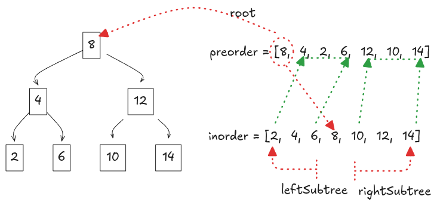

---
tags:
  - Trees
  - LC_Medium
  - Neetcode150
hide:
  - toc
---
# 105. Construct Binary Tree from Preorder and Inorder Traversal

[Problem Link](https://leetcode.com/problems/construct-binary-tree-from-preorder-and-inorder-traversal/){target=_blank}

Understand how **preorder** and **inorder** traversals define a binary tree uniquely.

In preorder traversal, the first element is always the **root** of the current subtree. In inorder traversal, all nodes 
to the **left of the root** belong to the left subtree, and all nodes to the **right** belong to the right subtree. 
Combining these two properties allows us to recursively reconstruct the tree.
{loading=lazy width=400vw align=right}

Finding root node in inorder array directly would be expensive task making our solution $O(n^2)$, instead we can 
maintain a Hashmap of val to index for `inorder` array to get the index in constant time. 

To implement this approach recursively, we use a helper function that uses `left` and `right` pointer to specify the 
left and right subtree in inorder array. To point to start of preorder array, we use `pre_idx`, since this tells us 
the next root to create. To efficiently locate the root position in the inorder array, we use our hashmap.
If the (`left`, `right`) is invalid, we return `None`. Otherwise, we take the next value from preorder as the root, 
find its position in inorder array, and recursively build the left and right subtrees using the corresponding inorder 
ranges.


??? note "Runtime Complexity"
    **Time**: $O(n)$, since each node is processed once

    **Space**: $O(n)$ for the hashmap and recursion stack


=== "Python"

    ```python
    --8<-- "docs/DSA/src/py/construct_binary_tree_from_preorder_and_inorder_traversal.py:7"
    ```

=== "Go"

    ```go
    --8<-- "docs/DSA/src/go/construct_binary_tree_from_preorder_and_inorder_traversal.go:3"
    ```