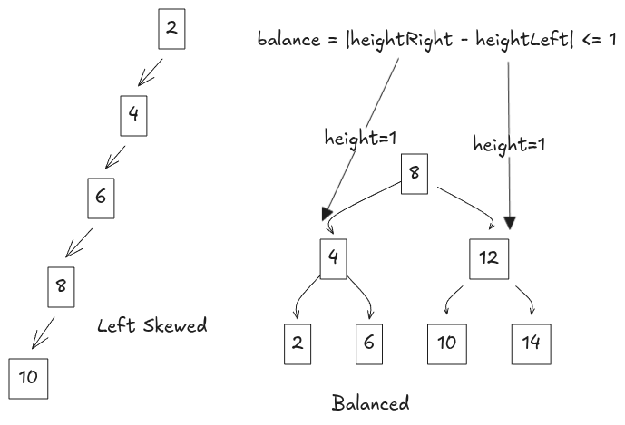

---
hide:
  - toc
---

# Trees

## Tree Traversal Algorithms

There are different ways to travel Tree since tree don't have a natural linear order.


### Depth First Search

DFS explores as deep as possible before backtracking to neighboring nodes. For each node, you've decision to select
explore left or right when going deep, based on which we've the following variations of DFS:

1. **Inorder Traversal**: visiting node in order, from left → root → right. When used with BST, it produces sorted
   output.

    !!! note "Pseudocode"
        ```text
        Inorder(node):
            Inorder(node.left)
            visit(node)
            Inorder(node.right)
        ```

2.  **Preorder Traversal**: root → left → right, commonly used to copy a tree or in tree serialization
    
    !!! note "Pseudocode"
        ```text
        Preorder(node):
            visit(node)
            Preorder(node.left)
            Preorder(node.right)
        ```

3. **Postorder Traversal**: left → right → root, useful for bottom-up computations,
    
    !!! note "Pseudocode"
        ```text
            Postorder(node):
                Postorder(node.left)
                Postorder(node.right)
                visit(node)
        ```


!!! note ""
    **Time Complexity**: $O(n)$, n is number of nodes
    
    **Space Complexity**: $O(h)$ from recursive stack, where h is tree height

### Breadth-First Search

BFS explores all neighboring nodes first before moving to child of the next node. This way, nodes are visited level by 
level from top to bottom, which is why it's also known as Level Order Traversal. The implementation involves using
queue, follow below pseudocode for full details

```text
LevelOrder(root):
    enqueue(root)
    while queue not empty:
        node = dequeue()
        visit(node)
        enqueue(node.left)
        enqueue(node.right)
```

BFS in tree is commonly used for problems like finding the shortest path,

!!! note ""
    **Time Complexity**: $O(n)$
    **Space Complexity**: $O(n)$

### Binary Search Tree

BST is a special binary tree with an ordering property for each node where  

- All values in the left subtree are smaller
- All values in the right subtree are greater

This property enables efficient searching as we can discard half of nodes at each iteration allowing
search within $O(logn)$ time for balanced BST to $O(n)$ for skewed BST(1).
{.annotate}

1. A balanced BST has each node follow rule: $|height(leftSubtree) - height(rightSubtree)| \le 1$ {width=400vw}

!!! note ""
    To keep a BST balanced, insertion and deletion must be careful to not imbalance any node. Data structure like 
    AVL-Trees, Red-Black Trees allow you to insert/delete while keeping the BST in balanced. Internally, they use 
    rotations to keep the tree balanced.
